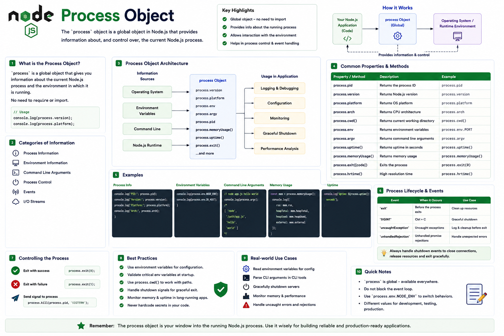

Have you ever wondered how Node.js knows:

🖥️ Which operating system it's running on?

📦 Which environment variables are available?

🚀 Which Node.js version is installed?

⚙️ What command-line arguments were passed?

The answer is the **`process` object**.

It's one of the most important global objects in Node.js, and you'll use it in almost every backend application.

Let's explore it. 👇

---

# What is the `process` Object?

The **`process` object** is a global object that provides information about, and control over, the current Node.js process.

Unlike most modules, you don't need to import it.

You can access it directly:

```javascript id="k8m4qx"
console.log(process);
```

It acts as a bridge between your application and the Node.js runtime.

---

# How It Works

When your application starts:

```text id="v2n7lp"
Operating System
        │
        ▼
Node.js Runtime
        │
Creates process Object
        │
        ▼
Your Application
```

The `process` object exposes runtime information and process-level APIs that your application can use.

---

# Common Properties

## 🆔 `process.pid`

Returns the process ID.

```javascript id="m7q2zc"
console.log(
  process.pid
);
```

Useful for debugging, monitoring, and logging.

---

## 🟢 `process.version`

Returns the current Node.js version.

```javascript id="f3x8wr"
console.log(
  process.version
);
```

Example:

```text id="t5k9mv"
v22.x.x
```

Helpful when checking compatibility.

---

## 🌍 `process.platform`

Returns the operating system platform.

```javascript id="c6r4jy"
console.log(
  process.platform
);
```

Possible values include:

```text id="q9v7nb"
linux

win32

darwin
```

---

## ⚙️ `process.arch`

Returns the CPU architecture.

```javascript id="y4m8kp"
console.log(
  process.arch
);
```

Example:

```text id="w1x6tr"
x64

arm64
```

---

# Environment Variables

One of the most common uses of the `process` object.

```javascript id="p8n3zf"
process.env.PORT;

process.env.JWT_SECRET;
```

This is how Node.js applications read configuration at runtime.

---

# Command-Line Arguments

The `process.argv` array contains the command-line arguments used to start your application.

Example:

```bash id="r2k9mv"
node app.js hello
```

Inside your app:

```javascript id="h7q5xd"
console.log(
  process.argv
);
```

Output:

```text id="n3v8pl"
[
  "node",
  "app.js",
  "hello"
]
```

This is commonly used when building CLI tools.

---

# Current Working Directory

Get the directory where the process was started.

```javascript id="b5m2zy"
process.cwd();
```

This is different from `__dirname`.

* `process.cwd()` → Current working directory.

* `__dirname` → Directory of the current CommonJS file.

Understanding the difference helps avoid path-related bugs.

---

# Memory Usage

Monitor memory consumption.

```javascript id="j4r7qn"
console.log(
  process.memoryUsage()
);
```

It returns details like:

* RSS
* Heap Total
* Heap Used
* External Memory

Useful for profiling long-running applications.

---

# Process Uptime

Find out how long the process has been running.

```javascript id="x9k6tp"
console.log(
  process.uptime()
);
```

The value is returned in seconds.

Helpful for health checks and monitoring.

---

# Exiting the Process

Terminate the application manually.

```javascript id="e6p3wv"
process.exit(0);
```

Exit code:

```text id="g2m8lr"
0
```

means success.

A non-zero exit code typically indicates an error.

In many cases, it's better to allow the event loop to finish naturally or perform cleanup before exiting.

---

# Listening for Signals

Applications can respond to operating system signals.

Example:

```javascript id="q7n4fz"
process.on(
  "SIGINT",
  () => {
    console.log(
      "Shutting down..."
    );
  }
);
```

Useful for:

✅ Closing database connections

✅ Stopping servers

✅ Cleaning up resources

before the application exits.

---

# Common Use Cases

The `process` object is commonly used for:

⚙️ Reading environment variables

📊 Monitoring memory usage

🚀 Logging runtime information

🖥️ CLI applications

📝 Health checks

🛑 Graceful shutdown

Almost every production Node.js application uses it.

---

# Best Practices

✅ Store configuration in `process.env`.

✅ Handle shutdown signals gracefully.

✅ Monitor memory in long-running services.

✅ Validate required environment variables during startup.

✅ Use `process.argv` for CLI tools.

---

# Common Mistakes

❌ Hardcoding secrets instead of using `process.env`.

❌ Calling `process.exit()` abruptly without cleanup.

❌ Confusing `process.cwd()` with `__dirname`.

❌ Ignoring process signals in production servers.

---

# `process.env` vs `process.argv`

Developers often mix these up.

### `process.env`

➡️ Environment variables.

Example:

```javascript id="u5v9kh"
process.env.PORT;
```

---

### `process.argv`

➡️ Command-line arguments.

Example:

```javascript id="z8r3qm"
node app.js hello
```

Both are part of the `process` object, but they serve completely different purposes.

---

# A Simple Way to Remember

🆔 **`pid`** → Process ID.

🌍 **`platform`** → Operating system.

⚙️ **`arch`** → CPU architecture.

🔐 **`env`** → Environment variables.

💾 **`memoryUsage()`** → Memory statistics.

📂 **`cwd()`** → Current working directory.

🚀 **`argv`** → Command-line arguments.

🛑 **`exit()`** → Exit the process.

Think of the `process` object as your application's **control center**.

It gives you everything you need to understand the runtime environment, access configuration, monitor resources, and manage your application's lifecycle.

Mastering it is an essential step toward building production-ready Node.js applications.

Which `process` property or method do you use the most?

🔹 `process.env`

🔹 `process.argv`

🔹 `process.cwd()`

🔹 `process.memoryUsage()`

👇 Let me know!

#NodeJS #JavaScript #Backend #ProcessObject #NodeInternals #WebDevelopment #Programming #SoftwareEngineering #ExpressJS #SystemDesign


