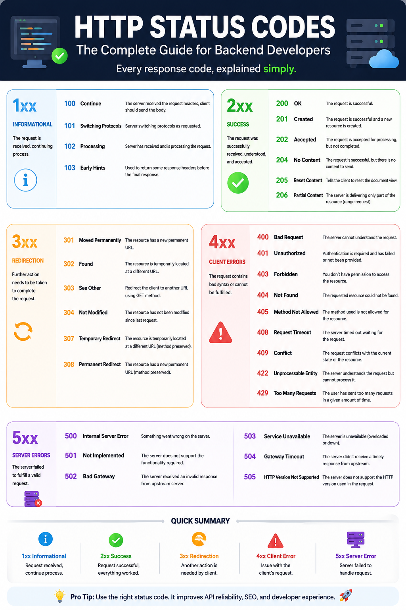

🚀 Every Backend Developer Should Know These HTTP Status Codes

If you're building REST APIs, choosing the right HTTP status code is just as important as writing the endpoint itself.

Here's a quick cheat sheet 👇

🟢 **2xx — Success**

* **200 OK** → Request completed successfully.
* **201 Created** → A new resource was created.
* **204 No Content** → Success, but nothing to return.

🟡 **3xx — Redirection**

* **301 Moved Permanently** → Resource has a new permanent URL.
* **302 Found** → Temporary redirect.
* **304 Not Modified** → Use the cached version.

🔴 **4xx — Client Errors**

* **400 Bad Request** → Invalid request or payload.
* **401 Unauthorized** → Authentication is required.
* **403 Forbidden** → Authenticated, but no permission.
* **404 Not Found** → Resource doesn't exist.
* **409 Conflict** → Request conflicts with current resource state.
* **422 Unprocessable Entity** → Validation failed.
* **429 Too Many Requests** → Rate limit exceeded.

🟣 **5xx — Server Errors**

* **500 Internal Server Error** → Something went wrong on the server.
* **502 Bad Gateway** → Invalid response from an upstream service.
* **503 Service Unavailable** → Server is temporarily unavailable.
* **504 Gateway Timeout** → Upstream server took too long to respond.

💡 **Best Practice**

Don't return `200 OK` for every request.

Using the correct status code makes your API:
✅ Easier to debug
✅ Easier to consume
✅ More RESTful
✅ More predictable for frontend developers

I still keep this cheat sheet nearby whenever I'm building APIs.

Which HTTP status code do you use most often in your backend projects?

#Backend #JavaScript #NodeJS #API #RESTAPI #WebDevelopment #SoftwareEngineering
