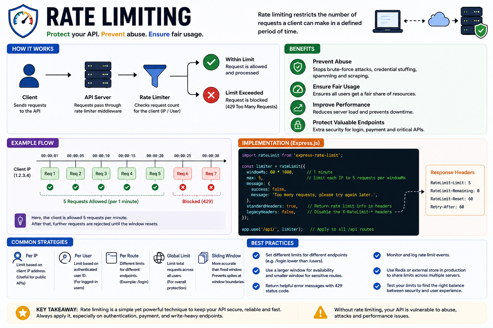

Imagine someone sends **10,000 requests** to your API in one minute.

Your server starts slowing down.

Database connections get exhausted.

Legitimate users can't access your application.

This is exactly why **Rate Limiting** is one of the first security measures every API should implement. 🛡️

Rate limiting controls **how many requests a client can make within a specific time window**, protecting your application from abuse while ensuring fair usage for everyone.

---

## What is Rate Limiting?

Rate limiting restricts the number of requests a client can send to your API over a defined period.

For example:

```text id="h2q7mn"
100 requests
per 15 minutes
per IP address
```

If the client exceeds the limit:

```http id="f6v9ra"
HTTP/1.1 429 Too Many Requests
```

The request is rejected until the limit resets.

---

## How It Works

Every request follows this flow:

```text id="n4b8px"
Client
   │
   ▼
API Request
   │
   ▼
Rate Limiter
   │
 ┌───────────────┐
 │ Within Limit? │
 └──────┬────────┘
        │
   Yes  │  No
        │
        ▼
 Process Request
        │
        ▼
 429 Too Many Requests
```

The rate limiter tracks requests based on identifiers such as:

* IP Address
* User ID
* API Key

---

## Why Rate Limiting Matters

Without rate limiting, your API is vulnerable to:

❌ Brute-force login attacks

❌ Credential stuffing

❌ API abuse

❌ Spam requests

❌ Web scraping

❌ Resource exhaustion

It also helps ensure that one user doesn't degrade the experience for everyone else.

---

## Common Rate Limiting Strategies

### 🔹 Fixed Window

A client gets a fixed number of requests within a time window.

Example:

```text id="r3m5zk"
100 requests
every 15 minutes
```

Simple to implement but can allow traffic spikes when the window resets.

---

### 🔹 Sliding Window

Tracks requests over a rolling time period instead of fixed intervals.

Provides smoother and more accurate rate limiting.

---

### 🔹 Token Bucket

Each client has a bucket of tokens.

Every request consumes one token.

Tokens refill over time.

Allows short bursts of traffic while still enforcing limits.

---

### 🔹 Leaky Bucket

Processes requests at a constant rate.

Excess requests wait or are rejected.

Useful for preventing sudden traffic spikes.

---

## Example in Express.js

Using `express-rate-limit`:

```js id="x8d2tp"
import rateLimit from "express-rate-limit";

const limiter = rateLimit({
  windowMs: 15 * 60 * 1000,
  max: 100,
});

app.use("/api", limiter);
```

Now each client can make up to **100 requests every 15 minutes**.

---

## Best Practices

✅ Apply stricter limits to sensitive routes like login and password reset.

✅ Use Redis for distributed rate limiting across multiple servers.

✅ Return HTTP **429 Too Many Requests** when limits are exceeded.

✅ Include helpful headers like:

* `RateLimit-Limit`
* `RateLimit-Remaining`
* `RateLimit-Reset`
* `Retry-After`

✅ Monitor rate-limit events to detect suspicious activity.

---

## Common Mistakes

❌ Applying the same limit to every endpoint.

❌ Forgetting rate limits on authentication routes.

❌ Not returning clear error messages.

❌ Relying only on IP-based limits for authenticated users.

❌ Ignoring distributed deployments where multiple servers need shared rate-limit state.

---

## Rate Limiting vs Throttling

These terms are often confused.

🚦 **Rate Limiting**

Limits how many requests are allowed within a time window.

Example:

100 requests every 15 minutes.

---

⏱️ **Throttling**

Controls how frequently requests are processed.

Instead of rejecting immediately, requests may be delayed or queued.

---

## A Simple Rule to Remember

🔒 **Authentication verifies who the user is.**

🛡️ **Authorization checks what they're allowed to do.**

🚦 **Rate Limiting controls how often they can do it.**

Together, these layers help keep your API secure, reliable, and scalable.

How do you implement rate limiting in your applications?

🔹 express-rate-limit

🔹 Redis

🔹 Nginx

🔹 API Gateway

🔹 Cloudflare

👇 Share your setup!

#NodeJS #ExpressJS #JavaScript #Backend #RateLimiting #API #WebSecurity #Redis #SoftwareEngineering #WebDevelopment

