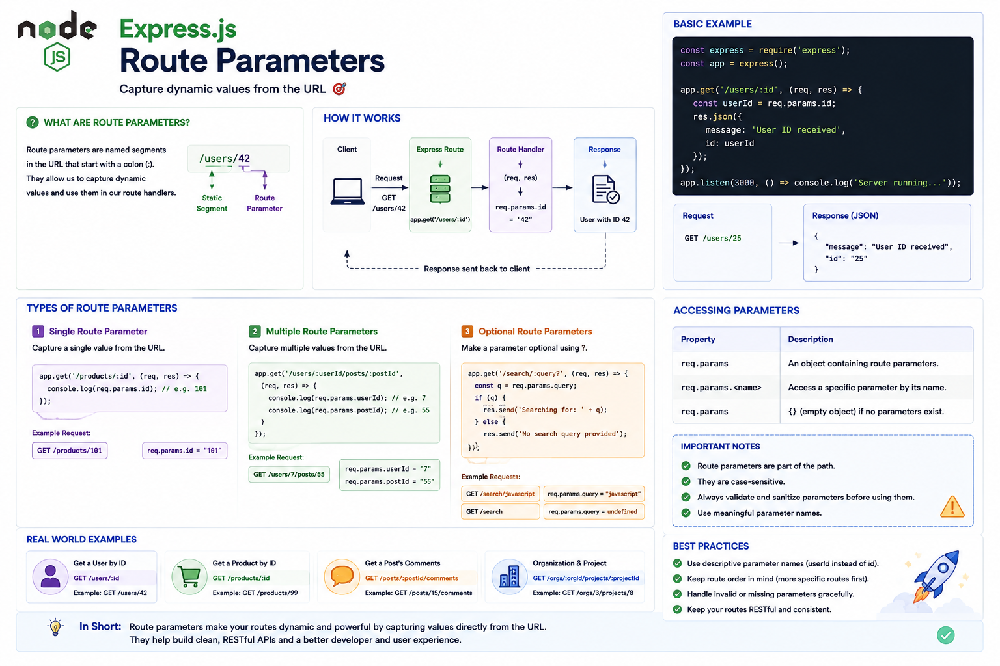

Have you ever seen a URL like this?

```text id="k8m2pq"
/users/42
```

or

```text id="n5v7rx"
/products/101
```

How does Express know that **42** is the user ID and **101** is the product ID?

The answer is **Route Parameters**.

They're one of the most commonly used features when building REST APIs.

Let's understand how they work. 👇

---

# What are Route Parameters?

**Route Parameters** are **dynamic values** embedded in the URL path.

They allow a single route to handle many different resources.

Example:

```javascript id="r4p9mx"
app.get(
  "/users/:id",
  handler
);
```

The `:id` is a route parameter.

Instead of creating a route for every user:

```text id="m7q3lv"
/users/1

/users/2

/users/3
```

You create one dynamic route that works for all users.

---

# How Route Parameters Work

When a request arrives:

```text id="w2n8kp"
GET /users/42
        │
        ▼
Express Router
        │
Matches:
 /users/:id
        │
        ▼
req.params.id
        │
        ▼
"42"
```

Express extracts the value from the URL and stores it in `req.params`.

---

# Accessing Route Parameters

Example:

```javascript id="x9m4zt"
app.get(
  "/users/:id",
  (req, res) => {
    console.log(
      req.params.id
    );

    res.send("Done");
  }
);
```

Request:

```text id="c6r8qy"
GET /users/42
```

Output:

```text id="f3v5pn"
42
```

The parameter is always available through:

```javascript id="h7q2mk"
req.params
```

---

# Multiple Route Parameters

A route can contain more than one parameter.

Example:

```javascript id="j5n9tx"
app.get(
  "/users/:userId/orders/:orderId",
  handler
);
```

Request:

```text id="b8m3rv"
GET /users/7/orders/105
```

Now:

```javascript id="q4p6zx"
req.params.userId;
// 7

req.params.orderId;
// 105
```

Perfect for nested resources.

---

# Real-World Examples

Get a user:

```text id="t9v2kn"
GET /users/42
```

Get a product:

```text id="p3m8lw"
GET /products/101
```

Get a blog post:

```text id="y6r4qx"
GET /posts/15
```

Delete an order:

```text id="g2k7mz"
DELETE /orders/500
```

Route parameters are used in almost every REST API.

---

# Route Parameters vs Query Parameters

Developers often confuse these.

### Route Parameter

```text id="u5p9vr"
/users/42
```

Access with:

```javascript id="l8n3qt"
req.params.id
```

Used to identify **which resource** you're working with.

---

### Query Parameter

```text id="d7m6ky"
/users?page=2
```

Access with:

```javascript id="v4q8ph"
req.query.page
```

Used for:

* Filtering
* Searching
* Sorting
* Pagination

A simple rule:

📍 **Route Parameters identify a resource.**

🔍 **Query Parameters modify the request.**

---

# Validating Parameters

Never assume a parameter is valid.

Example:

```javascript id="e2r7mx"
const id =
  Number(req.params.id);

if (
  Number.isNaN(id)
) {
  return res
    .status(400)
    .send("Invalid ID");
}
```

Always validate user input before using it.

---

# Common Use Cases

Route parameters are commonly used for:

👤 User IDs

📦 Product IDs

📝 Blog posts

📁 File IDs

💳 Order IDs

🏢 Organization IDs

If you're accessing a specific resource, a route parameter is usually the right choice.

---

# Best Practices

✅ Use descriptive parameter names like `userId` or `productId`.

✅ Validate parameter values before using them.

✅ Keep URLs RESTful and meaningful.

✅ Return a **404 Not Found** response if the requested resource doesn't exist.

---

# Common Mistakes

❌ Confusing route parameters with query parameters.

❌ Using generic names like `:data` or `:value`.

❌ Skipping validation.

❌ Trusting user input without checking it.

❌ Embedding filters or sorting options inside route parameters instead of query parameters.

---

# A Simple Way to Remember

📍 **`:id`** → Dynamic value in the URL.

📨 **`req.params`** → Access route parameters.

👤 **Route Parameters** → Identify a specific resource.

🔍 **Query Parameters** → Filter or modify the request.

Think of route parameters like a **house address**.

🏠 `/users/42`

The street (`/users`) tells you the neighborhood.

The house number (`42`) tells you exactly which house to visit.

Without the house number, you know the area—but not the exact destination.

That's exactly what route parameters do in Express.

They help your application identify the exact resource the client is requesting.

How often do you use route parameters in your APIs?

👇 Let me know!

#NodeJS #ExpressJS #JavaScript #Backend #Routing #RESTAPI #WebDevelopment #Programming #SoftwareEngineering #FullStack

