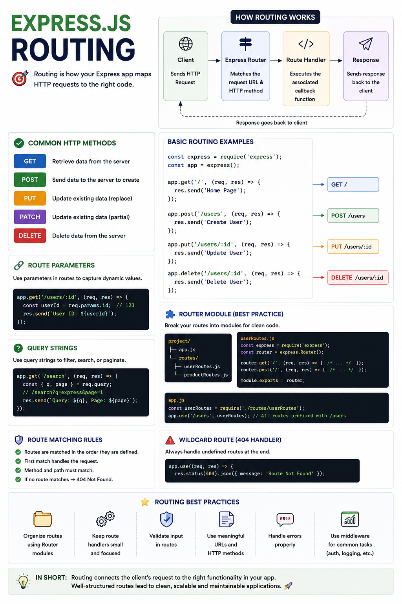

Imagine a user opens:

```
GET /products/25
```

How does Express know **which function should handle that request?**

That's the job of **Routing**.

Routing is one of the core features of Express.js, allowing your application to map incoming HTTP requests to the correct handler.

Let's understand how it works. 👇

---

# What is Routing?

**Routing** is the process of matching an incoming HTTP request to the appropriate function based on:

✅ HTTP Method

✅ URL Path

For example:

```text id="m7q2xp"
GET    /users

POST   /users

PUT    /users/5

DELETE /users/5
```

Even though the URL may be similar, Express chooses a different handler depending on the HTTP method.

---

# Why Do We Need Routing?

Without routing, your server would have to manually inspect every request and decide what to do.

Express handles this for you, making your code:

✅ Cleaner

✅ Easier to maintain

✅ More scalable

---

# How Routing Works

When a request arrives:

```text id="x5n8lv"
Client
   │
HTTP Request
   │
   ▼
Express App
   │
Route Matching
(Method + URL)
   │
   ▼
Route Handler
   │
Business Logic
   │
   ▼
Response
```

If no route matches, Express typically returns a **404 Not Found** response.

---

# Creating Routes

Express provides methods for common HTTP verbs.

Example:

```javascript id="g4r9zt"
app.get("/users", handler);

app.post("/users", handler);

app.put("/users/:id", handler);

app.delete("/users/:id", handler);
```

Each method registers a route for a specific HTTP method and path.

---

# Route Handlers

A route handler is simply a function that processes the request.

Example:

```javascript id="h8m3qw"
app.get(
  "/hello",
  (req, res) => {
    res.send("Hello!");
  }
);
```

It receives:

* `req` → Request object

* `res` → Response object

---

# Route Parameters

Sometimes part of the URL is dynamic.

Example:

```javascript id="n2p7kx"
app.get(
  "/users/:id",
  (req, res) => {
    console.log(
      req.params.id
    );
  }
);
```

Request:

```text id="j9v5mr"
GET /users/25
```

Output:

```text id="t6q8pb"
25
```

Route parameters are perfect for identifying specific resources.

---

# Query Parameters

For filtering, searching, or pagination, use query parameters.

Request:

```text id="f3m8zy"
GET /products?page=2
```

Access them with:

```javascript id="p7v4nl"
req.query.page
```

Unlike route parameters, query parameters are optional and don't affect route matching.

---

# Organizing Routes

As applications grow, keeping every route in one file becomes difficult.

Instead, use the Express Router.

Example:

```javascript id="r5k2tx"
const router =
  express.Router();
```

Then:

```javascript id="q8m6pv"
router.get("/", ...);

router.post("/", ...);
```

Finally:

```javascript id="c2n9jr"
app.use(
  "/users",
  router
);
```

This keeps your project modular and easier to maintain.

---

# Route-Level Middleware

Routes can have middleware that runs before the handler.

Example:

```javascript id="v4q7km"
app.get(
  "/profile",
  authMiddleware,
  controller
);
```

The flow becomes:

```text id="b6x3rp"
Request
   │
   ▼
Middleware
   │
   ▼
Route Handler
   │
   ▼
Response
```

This is commonly used for:

🔐 Authentication

🛡️ Authorization

✅ Validation

---

# Route Order Matters

Express checks routes **from top to bottom**.

Example:

```javascript id="w9p4tx"
app.get(
  "/users/:id",
  ...
);

app.get(
  "/users/me",
  ...
);
```

A request to:

```text id="k7r2mn"
/users/me
```

may be matched by `/users/:id` before it reaches `/users/me`.

A better approach:

```javascript id="m3v8qy"
app.get(
  "/users/me",
  ...
);

app.get(
  "/users/:id",
  ...
);
```

Define more specific routes before dynamic ones.

---

# Common HTTP Methods

| Method | Purpose               |
| ------ | --------------------- |
| GET    | Retrieve data         |
| POST   | Create new data       |
| PUT    | Replace existing data |
| PATCH  | Partially update data |
| DELETE | Remove data           |

Choosing the right method helps create predictable and RESTful APIs.

---

# Best Practices

✅ Organize routes by feature or resource.

✅ Use meaningful URL names.

✅ Keep route handlers small.

✅ Move business logic into services.

✅ Validate incoming request data.

✅ Use route-level middleware when appropriate.

---

# Common Mistakes

❌ Defining routes in the wrong order.

❌ Putting database logic directly inside route handlers.

❌ Creating one massive routes file.

❌ Using the wrong HTTP method.

❌ Ignoring input validation.

---

# A Simple Way to Remember

🛣️ **Route** → Defines where a request should go.

📨 **Request** → Arrives from the client.

🎯 **Route Matching** → Matches the HTTP method and URL.

🧠 **Handler** → Executes the required logic.

📤 **Response** → Sends the result back.

Think of routing like a GPS navigation system.

🚗 A request is the traveler.

🗺️ The route tells it exactly where to go.

🏠 The destination is the correct route handler.

Without routing, every request would be lost.

With Express routing, every request finds the right destination quickly and efficiently.

What's your preferred way to organize routes in Express projects?

👇 Feature-based folders or resource-based folders?

#NodeJS #ExpressJS #JavaScript #Backend #Routing #RESTAPI #WebDevelopment #Programming #SoftwareEngineering #FullStack


