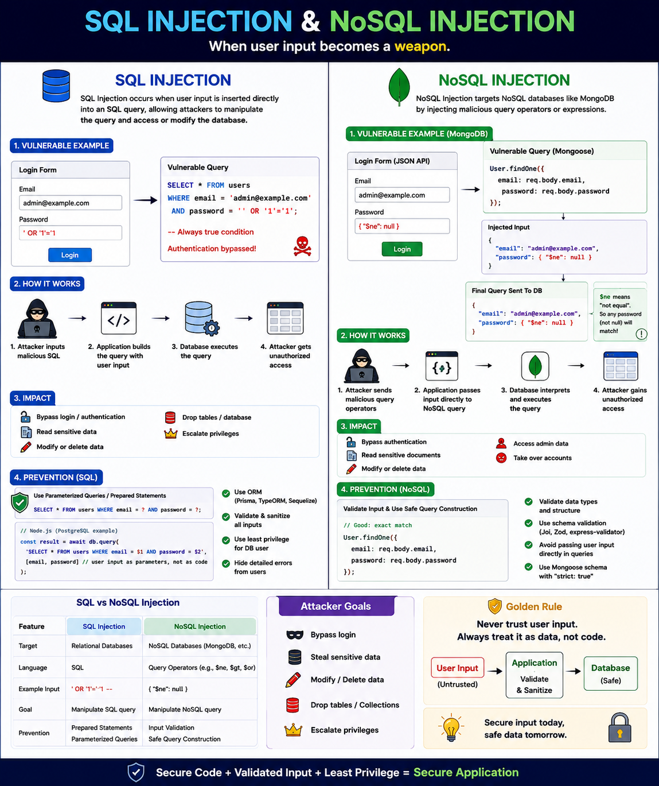

One of the most dangerous security vulnerabilities isn't a zero-day exploit...

It's **trusting user input.**

A single unvalidated input can allow an attacker to read, modify, or even delete your entire database.

That's where **SQL Injection** and **NoSQL Injection** come in.

---

## SQL Injection

SQL Injection happens when user input is directly concatenated into a SQL query.

❌ Vulnerable:

```sql
SELECT * FROM users
WHERE email = '${email}'
AND password = '${password}';
```

If an attacker enters:

```text
' OR '1'='1
```

The query becomes:

```sql
SELECT * FROM users
WHERE email = '' OR '1'='1';
```

Since `'1'='1'` is always true, the attacker may bypass authentication.

---

## NoSQL Injection

NoSQL databases (like MongoDB) aren't immune.

Imagine this login query:

```js
User.findOne({
  email: req.body.email,
  password: req.body.password,
});
```

If the input isn't validated, an attacker could send:

```json
{
  "email": "admin@example.com",
  "password": {
    "$ne": null
  }
}
```

`$ne` means **"not equal."**

The query now becomes:

```js
{
  email: "admin@example.com",
  password: { $ne: null }
}
```

If a matching user exists, authentication may succeed without knowing the password.

---

## What Can an Attacker Do?

❌ Bypass login

❌ Read sensitive data

❌ Modify database records

❌ Delete tables or collections

❌ Escalate privileges

---

## How to Prevent Injection Attacks

✅ Use **parameterized queries** or prepared statements.

✅ Never concatenate user input into queries.

✅ Validate and sanitize all incoming data.

✅ Use an ORM/ODM (Prisma, TypeORM, Mongoose, Sequelize).

✅ Restrict database permissions using least privilege.

✅ Return generic error messages to avoid leaking database details.

---

## SQL vs NoSQL Injection

🗄️ **SQL Injection**

* Targets relational databases
* Manipulates SQL queries
* Prevent with prepared statements

🍃 **NoSQL Injection**

* Targets document databases like MongoDB
* Exploits query operators (`$ne`, `$gt`, `$or`, etc.)
* Prevent with strict input validation and safe query construction

---

The safest query is one where **user input is treated as data—not executable code.**

Never trust client input, even if it's coming from your own frontend.

Have you ever encountered an SQL or NoSQL injection vulnerability while developing an application?

👇 Share your experience!

#NodeJS #JavaScript #SQLInjection #NoSQL #MongoDB #PostgreSQL #Backend #CyberSecurity #WebDevelopment #SoftwareEngineering
