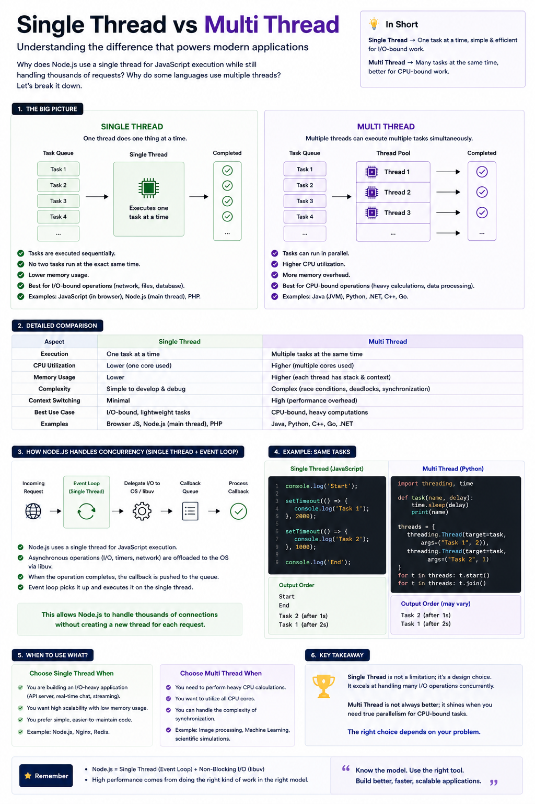

**Single Thread vs Multi Thread 🧵**

Many developers think **single-threaded = slow**.

That's not true.

The real question is: **What kind of work is your application doing?**

Here's the difference:

🟢 **Single Thread**
• Executes one JavaScript task at a time.
• Simpler to build and debug.
• Lower memory usage.
• Perfect for **I/O-bound** work (API calls, databases, file systems, networking).

🔵 **Multi Thread**
• Multiple threads execute tasks in parallel.
• Better CPU utilization.
• Higher memory and synchronization overhead.
• Best for **CPU-bound** work (image processing, video encoding, ML, heavy calculations).

💡 **Then how does Node.js handle thousands of requests?**

Node.js doesn't create a new thread for every request.

Instead:

1. JavaScript runs on a **single main thread**.
2. Long-running I/O is delegated to **libuv / the operating system**.
3. When the work is finished, the callback is placed in the queue.
4. The **Event Loop** picks it up and executes it.

That's why Node.js can handle massive concurrency without thousands of threads.

**Rule of thumb:**

✅ Use **Single Thread** when:

* Building REST APIs
* Real-time apps
* Chat applications
* Streaming services
* CRUD applications

✅ Use **Multi Thread** when:

* Image/video processing
* Data analytics
* Scientific computing
* Machine Learning
* Heavy mathematical computations

🚀 **Key takeaway:**

**Single Thread isn't a limitation—it's a design choice.**

Choose the concurrency model based on your workload:

* **I/O-bound → Single Thread + Event Loop**
* **CPU-bound → Multi Thread**

Understanding this distinction will help you choose the right technology for your next backend project.

#JavaScript #NodeJS #Backend #WebDevelopment #Programming #SoftwareEngineering #Coding #Developer #Tech

