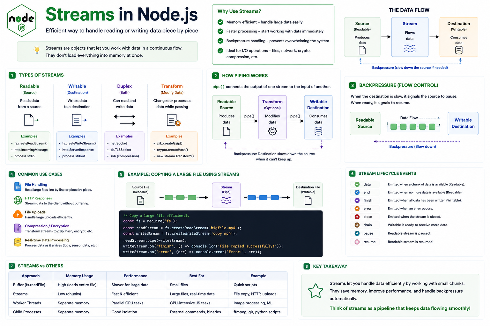

Imagine your server needs to send a **5 GB video** to a user.

Would you load the entire file into memory first?

```js id="m1f9qc"
const data = fs.readFileSync("movie.mp4");
```

Probably not. 🚫

Loading huge files into memory wastes RAM and can slow down or even crash your application.

That's why Node.js provides one of its most powerful features:

**Streams.** 🌊

Streams let you process data **piece by piece (chunks)** instead of loading everything at once.

---

## What are Streams?

A **Stream** is an object that allows you to **read, write, or transform data continuously**.

Instead of waiting for the entire data to be available, streams process small chunks as they arrive.

Think of it like drinking water through a straw instead of trying to drink the whole bottle at once.

---

## Why Use Streams?

Without streams:

```text id="c8r5kw"
Read Entire File
        │
        ▼
Store in Memory
        │
        ▼
Process Data
```

With streams:

```text id="h2m7xt"
Read Chunk
   │
Process
   │
Send
   │
Repeat...
```

Benefits:

✅ Low memory usage

✅ Faster processing

✅ Better scalability

✅ Ideal for large files and real-time data

---

## Types of Streams

Node.js provides four main types.

### 📖 Readable Stream

Used to **read** data.

Examples:

* Files
* HTTP requests
* Network sockets

Example:

```js id="z4p2nb"
fs.createReadStream("video.mp4");
```

---

### ✍️ Writable Stream

Used to **write** data.

Examples:

* Files
* HTTP responses

Example:

```js id="n6v8yd"
fs.createWriteStream("copy.mp4");
```

---

### 🔄 Duplex Stream

Can both **read and write**.

Examples:

* TCP sockets
* WebSockets

A duplex stream acts as both a readable and writable stream.

---

### ⚙️ Transform Stream

A special duplex stream that **modifies data while it's flowing**.

Examples:

* Compression (`zlib`)
* Encryption (`crypto`)
* CSV or JSON transformations

Input and output are different because the data is transformed along the way.

---

## How Streams Work

Imagine copying a large file.

Instead of:

```text id="g5q3ra"
Read Entire File
        │
        ▼
Write Entire File
```

Streams do this:

```text id="y9x6le"
Read Chunk
      │
      ▼
Pipe
      │
      ▼
Write Chunk
      │
      ▼
Repeat...
```

Only a small portion of the file is in memory at any given time.

---

## Piping Streams

One of the best features of streams is **pipe()**.

It connects a readable stream directly to a writable stream.

Example:

```js id="b7m4kh"
const read = fs.createReadStream("movie.mp4");
const write = fs.createWriteStream("copy.mp4");

read.pipe(write);
```

Node.js automatically handles moving data from the source to the destination efficiently.

---

## Backpressure

What happens if the destination is slower than the source?

Example:

Reading a file faster than the disk or network can write it.

Without control:

❌ Memory usage keeps growing.

❌ The application can become unstable.

Streams solve this using **backpressure**.

When the writable stream can't keep up, Node.js temporarily slows or pauses the readable stream until it's ready again.

This built-in flow control is one of the reasons streams are so efficient.

---

## Common Use Cases

📁 Reading large files

📤 File uploads

🎥 Video streaming

📦 Downloading large files

🌐 HTTP request and response streaming

🗜️ Compression

🔐 Encryption

📊 Real-time log processing

Whenever data is large or continuous, streams are usually the right tool.

---

## Streams vs `readFile()`

### `readFile()`

✅ Simple to use

❌ Loads the entire file into memory

Best for:

* Small files

---

### Streams

✅ Reads data chunk by chunk

✅ Uses much less memory

✅ Starts processing immediately

Best for:

* Large files
* Media streaming
* Real-time processing

---

## Common Stream Events

Readable streams emit events like:

* `data`
* `end`
* `error`

Writable streams commonly emit:

* `finish`
* `error`

These events let you react as data flows through your application.

---

## Best Practices

✅ Use streams for large files.

✅ Prefer `pipe()` instead of manually moving chunks when appropriate.

✅ Handle stream errors.

✅ Close streams properly when work is complete.

✅ Let backpressure manage data flow instead of buffering everything in memory.

---

## Common Mistakes

❌ Using `readFile()` for multi-GB files.

❌ Ignoring `error` events.

❌ Forgetting to close streams.

❌ Reading entire datasets when streaming would be more efficient.

---

## A Simple Way to Remember

📖 **Readable** → Produces data.

✍️ **Writable** → Consumes data.

🔄 **Duplex** → Produces and consumes data.

⚙️ **Transform** → Produces, modifies, and consumes data.

Think of streams like a **pipeline**.

Water doesn't wait until the entire river arrives before flowing through a pipe.

It moves continuously.

Node.js streams work the same way—processing data as it flows instead of all at once.

That's why they're one of the most powerful tools for building fast, memory-efficient backend applications.

Have you used streams in a real project?

👇 What was your use case?

#NodeJS #JavaScript #Streams #Backend #WebDevelopment #Performance #SoftwareEngineering #Programming #SystemDesign #ExpressJS


