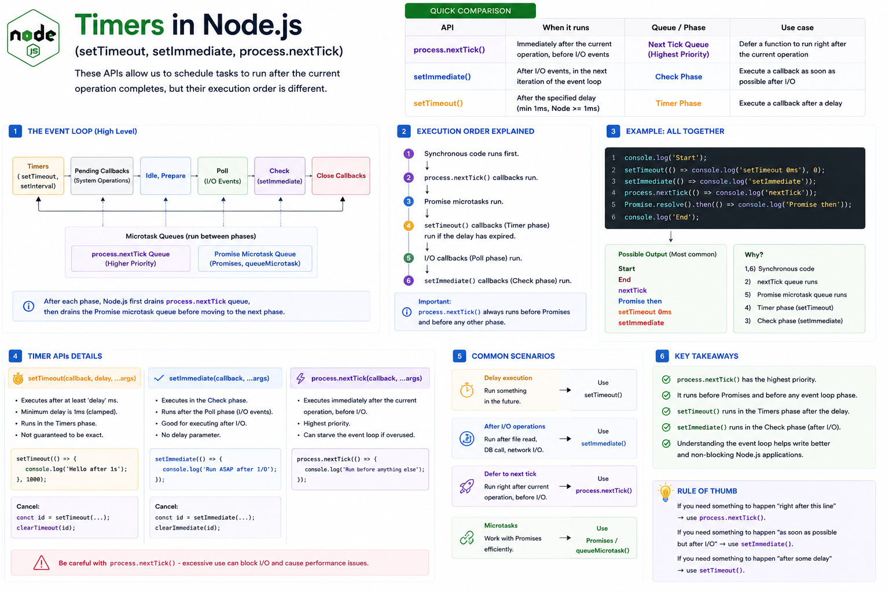

Have you ever wondered why this code doesn't execute in the order you expect?

```javascript
console.log("Start");

setTimeout(() => console.log("setTimeout"), 0);

setImmediate(() => console.log("setImmediate"));

process.nextTick(() => console.log("nextTick"));

console.log("End");
```

Understanding **`setTimeout()`**, **`setImmediate()`**, and **`process.nextTick()`** is one of the keys to mastering the **Node.js Event Loop**.

Although all three schedule code to run later, **they don't run at the same time or with the same priority.**

Let's break it down. 👇

---

## Why Do We Need These APIs?

Node.js is **single-threaded**.

If every task executed immediately, asynchronous programming wouldn't be possible.

These scheduling APIs let us defer work without blocking the Event Loop.

They're commonly used for:

⏱️ Delayed execution

📂 Processing I/O callbacks

🔄 Deferring work

⚡ Scheduling asynchronous operations

---

# 1️⃣ `setTimeout()`

`setTimeout()` schedules a callback to run **after at least the specified delay**.

Example:

```javascript
setTimeout(() => {
  console.log("Hello");
}, 1000);
```

This means:

> "Run this callback **after at least 1000ms**."

Important:

The callback **isn't guaranteed** to execute exactly after 1000ms.

If the Event Loop is busy, it may run later.

---

## Where Does It Run?

`setTimeout()` callbacks execute during the **Timers phase** of the Event Loop.

```text
Timers Phase
      │
      ▼
setTimeout()
setInterval()
```

---

## Common Use Cases

✅ Retry logic

✅ Delayed notifications

✅ Debouncing

✅ Scheduling future work

---

# 2️⃣ `setImmediate()`

`setImmediate()` schedules a callback to execute during the **Check phase** of the Event Loop.

Example:

```javascript
setImmediate(() => {
  console.log("Done");
});
```

Unlike `setTimeout()`, it doesn't accept a delay.

Its goal is simply:

> "Run this callback during the next Check phase."

This is often useful after I/O operations.

---

## Where Does It Run?

```text
Check Phase
      │
      ▼
setImmediate()
```

If you schedule `setImmediate()` from inside an I/O callback, it typically runs before a newly scheduled `setTimeout(..., 0)` because the Event Loop proceeds to the Check phase before starting the next Timers phase.

Outside of I/O callbacks, the relative order between `setImmediate()` and `setTimeout(..., 0)` is **not guaranteed** and can vary.

---

## Common Use Cases

✅ Continue work after I/O

✅ Break large tasks into smaller asynchronous steps

---

# 3️⃣ `process.nextTick()`

This one is different.

It **does not wait for the next Event Loop phase**.

Instead:

It runs **immediately after the current JavaScript operation completes**, before the Event Loop continues.

Example:

```javascript
process.nextTick(() => {
  console.log("Next Tick");
});
```

Its callbacks are stored in the **Next Tick Queue**, which Node.js processes before moving on to other phases of the Event Loop.

---

## Execution Priority

Suppose we write:

```javascript
console.log("1");

process.nextTick(() => {
  console.log("2");
});

console.log("3");
```

Output:

```text
1
3
2
```

The synchronous code runs first.

Then `process.nextTick()` executes before the Event Loop continues.

---

## Complete Example

```javascript
console.log("Start");

setTimeout(() => {
  console.log("Timeout");
}, 0);

setImmediate(() => {
  console.log("Immediate");
});

process.nextTick(() => {
  console.log("Next Tick");
});

Promise.resolve().then(() => {
  console.log("Promise");
});

console.log("End");
```

A common output is:

```text
Start
End
Next Tick
Promise
Timeout / Immediate
```

Notice:

✅ Synchronous code runs first.

✅ `process.nextTick()` runs before Promise callbacks.

✅ Promise microtasks run before timers.

✅ `setTimeout()` and `setImmediate()` run later, with their relative order depending on the context.

---

## Comparison

| API                  | Runs In         | Priority | Best For                                               |
| -------------------- | --------------- | -------- | ------------------------------------------------------ |
| `process.nextTick()` | Next Tick Queue | Highest  | Deferring work until after the current operation       |
| `setTimeout()`       | Timers Phase    | Lower    | Run after a minimum delay                              |
| `setImmediate()`     | Check Phase     | Lower    | Run after the current poll phase, especially after I/O |

---

## Common Mistakes

❌ Assuming `setTimeout(fn, 0)` runs immediately.

❌ Thinking `setImmediate()` always runs before `setTimeout(0)`.

❌ Overusing `process.nextTick()`, which can delay I/O if the queue is continuously filled.

❌ Confusing Promise microtasks with `process.nextTick()`.

---

## Best Practices

✅ Use `setTimeout()` for delayed execution.

✅ Use `setImmediate()` when scheduling work after I/O or to defer to the Check phase.

✅ Use `process.nextTick()` sparingly for short, high-priority callbacks that should run immediately after the current operation.

✅ Understand how these APIs fit into the Event Loop before optimizing performance.

---

## A Simple Way to Remember

⚡ **`process.nextTick()`**

➡️ "Run immediately after the current operation."

---

⏱️ **`setTimeout()`**

➡️ "Run after at least this delay."

---

🚀 **`setImmediate()`**

➡️ "Run in the Check phase, often after I/O callbacks."

Understanding these APIs helps explain why asynchronous code executes in a particular order and gives you better control over scheduling work in Node.js.

Once you understand them, the Event Loop becomes much easier to reason about.

Which of these APIs has confused you the most?

🔹 `setTimeout()`

🔹 `setImmediate()`

🔹 `process.nextTick()`

👇 Let me know!

#NodeJS #JavaScript #EventLoop #Backend #Programming #WebDevelopment #SoftwareEngineering #Async #NodeInternals #ExpressJS


