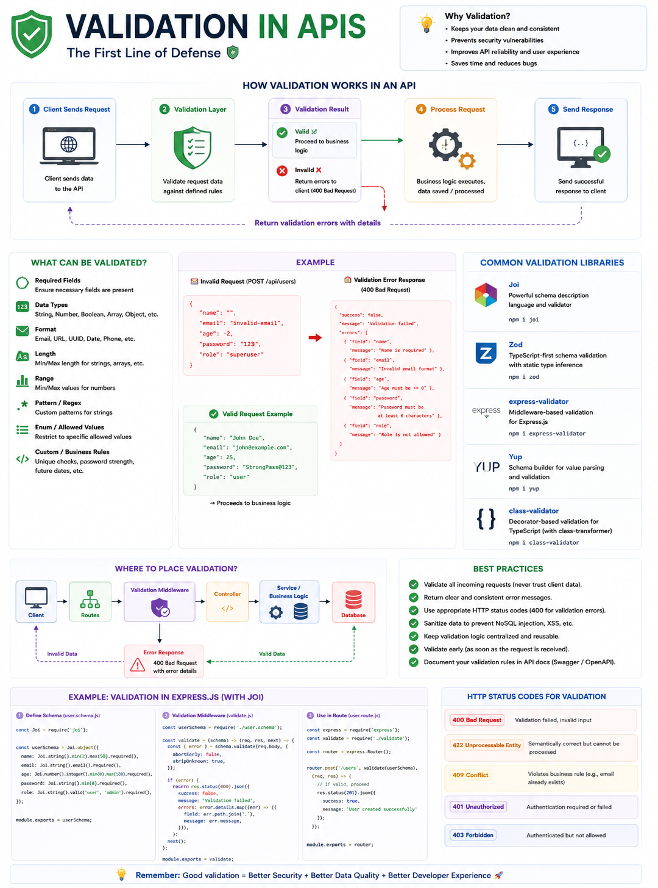

One of the biggest mistakes backend developers make is trusting user input.

**Never trust data coming from the client.**

Every API request should be treated as **untrusted** until it's validated. 🛡️

Imagine a user sends this request:

```json
{
  "name": "",
  "email": "not-an-email",
  "age": -5,
  "password": "123"
}
```

Without validation, your application might:

❌ Store invalid data in the database.

❌ Crash due to unexpected input.

❌ Become vulnerable to security attacks.

That's why **validation** should always be the first line of defense.

### A good validation layer checks:

✅ Required fields

✅ Correct data types

✅ Email format

✅ Password strength

✅ String length

✅ Number ranges

✅ UUID/ObjectId format

✅ Custom business rules

If the request is invalid, reject it immediately:

```http
HTTP/1.1 400 Bad Request
```

```json
{
  "success": false,
  "message": "Validation failed",
  "errors": [
    {
      "field": "email",
      "message": "Invalid email format"
    }
  ]
}
```

This keeps your API predictable, secure, and easier to debug.

### Validation ≠ Authentication ≠ Authorization

These three are often confused:

🟢 **Validation**
"Is the request data correct?"

🔐 **Authentication**
"Who is making this request?"

🛡️ **Authorization**
"Does this user have permission to perform this action?"

A secure API performs all three—in that order.

### Best Practices

✅ Validate every request.

✅ Return clear and consistent error messages.

✅ Sanitize user input before processing.

✅ Validate on the server, even if the frontend already validates.

✅ Centralize validation logic using middleware or schema validators (like Zod, Joi, Yup, or express-validator).

Great APIs don't just process requests—they reject bad ones before they become problems.

What's your preferred validation library for Node.js?

🔹 Zod
🔹 Joi
🔹 express-validator
🔹 Yup
🔹 Something else?

👇 Let's discuss.

#NodeJS #JavaScript #Backend #API #Validation #ExpressJS #WebDevelopment #SoftwareEngineering #SystemDesign #Programming
