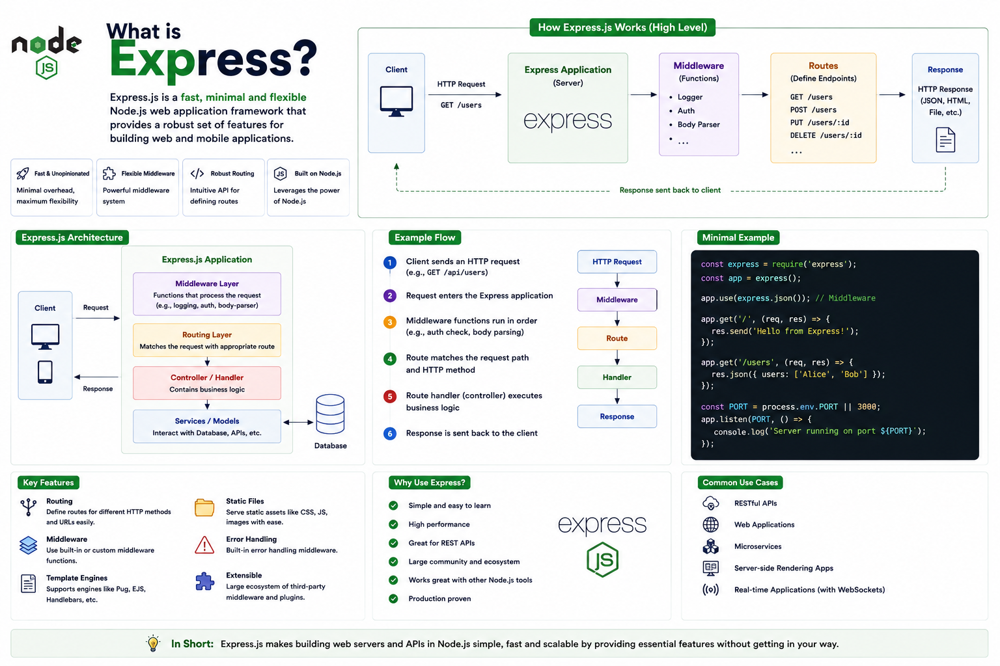

Imagine building a web server in pure Node.js.

You'd need to manually handle:

📨 HTTP requests

🛣️ URL routing

📦 Request body parsing

❌ Error handling

📄 Responses

It works...

But it quickly becomes repetitive and difficult to maintain.

That's why most Node.js developers use **Express.js**.

Let's understand what it is and why it's so popular. 👇

---

# What is Express.js?

**Express.js** is a **fast, minimal, and flexible web framework for Node.js**.

It provides a simple layer of features on top of Node's built-in `http` module, making it much easier to build web servers and APIs.

Instead of writing lots of boilerplate code, Express gives you clean and intuitive APIs for common backend tasks.

---

# Why Do We Need Express?

Without Express:

* Handle routes manually
* Parse request bodies yourself
* Manage middleware logic
* Write repetitive server code

With Express:

✅ Simple routing

✅ Middleware support

✅ Easy request & response handling

✅ Cleaner project structure

It lets you focus on building your application instead of low-level HTTP details.

---

# How Express Works

A typical request flows like this:

```text id="h7m2qx"
Client
   │
HTTP Request
   │
   ▼
Express App
   │
Middleware
   │
Route Handler
   │
Business Logic
   │
Response
   │
   ▼
Client
```

Every request passes through your Express application before a response is sent back.

---

# Creating an Express App

A minimal Express server looks like this:

```javascript id="q4v8nz"
import express from "express";

const app = express();

app.get("/", (req, res) => {
  res.send("Hello, World!");
});

app.listen(3000);
```

With just a few lines of code, you have a working web server.

---

# Core Features of Express

## 🛣️ Routing

Handle different URLs and HTTP methods easily.

Example:

```javascript id="x8p3mr"
app.get("/users", ...);

app.post("/users", ...);

app.put("/users/:id", ...);

app.delete("/users/:id", ...);
```

---

## ⚙️ Middleware

Middleware functions run before your route handler.

They can:

✅ Log requests

✅ Authenticate users

✅ Parse request bodies

✅ Validate data

✅ Handle errors

Middleware is one of Express's most powerful features.

---

## 📦 Request & Response Objects

Every route receives:

```javascript id="t6k9fy"
(req, res)
```

* `req` → Incoming request information

* `res` → Response sent back to the client

These objects make working with HTTP much simpler.

---

## 🌐 REST APIs

Express is one of the most popular frameworks for building REST APIs.

Example endpoints:

```text id="v3q7lw"
GET    /users

POST   /users

PUT    /users/:id

DELETE /users/:id
```

Its routing system maps naturally to RESTful design.

---

# Common Use Cases

Express is widely used for:

🌐 REST APIs

🛒 E-commerce backends

📱 Mobile app APIs

🔐 Authentication services

🧩 Microservices

📊 Admin dashboards

It's flexible enough for small projects and large production systems.

---

# Express vs Node.js

Developers often confuse these.

### Node.js

✅ JavaScript runtime

✅ Executes JavaScript outside the browser

✅ Provides built-in modules like `http`, `fs`, and `path`

---

### Express.js

✅ Framework built on top of Node.js

✅ Simplifies backend development

✅ Adds routing, middleware, and other web development features

A simple way to think about it:

**Node.js is the engine.**

**Express.js is the car built on top of that engine.**

---

# Best Practices

✅ Organize routes into separate files.

✅ Keep controllers focused on business logic.

✅ Use middleware for reusable functionality.

✅ Implement centralized error handling.

✅ Validate incoming request data.

---

# Common Mistakes

❌ Putting all routes in one file.

❌ Writing business logic directly inside route handlers.

❌ Ignoring error handling.

❌ Not validating user input.

❌ Creating very large middleware functions that handle multiple responsibilities.

---

# A Simple Way to Remember

🟢 **Node.js** → Runs JavaScript on the server.

⚡ **Express.js** → Makes building web servers and APIs easier.

🛣️ **Routes** → Decide which code handles a request.

⚙️ **Middleware** → Process requests before they reach a route.

📨 **Request → Middleware → Route → Response**

Think of Express like a restaurant.

👤 **Client** = Customer placing an order.

👨‍🍳 **Express** = Restaurant staff organizing the workflow.

⚙️ **Middleware** = Waiters checking reservations, taking orders, and preparing requests.

🍽️ **Route Handler** = Chef preparing the meal.

📦 **Response** = The finished meal delivered back to the customer.

Express handles the flow, so you can focus on building the features that matter.

Have you built your backend with Express.js, or are you exploring alternatives like Fastify or NestJS?

👇 I'd love to hear your thoughts!

#NodeJS #ExpressJS #JavaScript #Backend #WebDevelopment #RESTAPI #Programming #SoftwareEngineering #FullStack #WebDev


