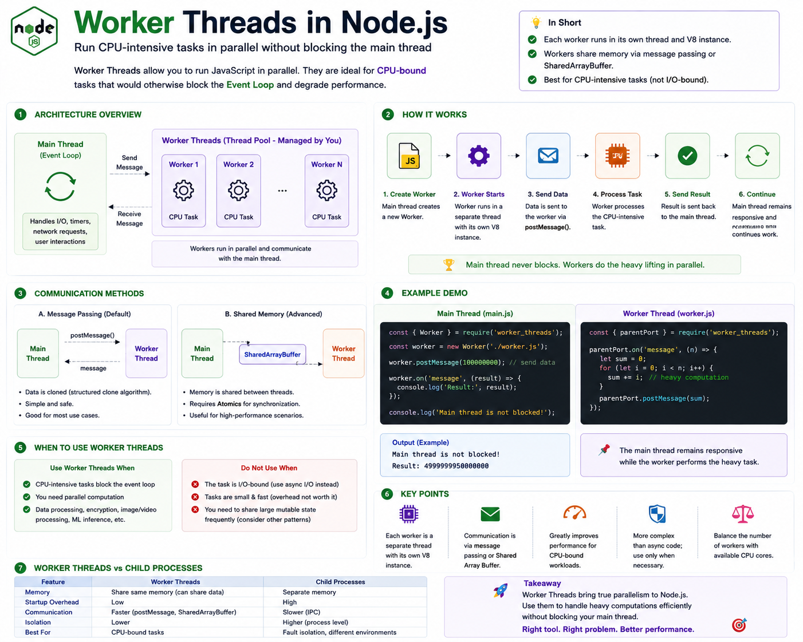

One of the biggest myths about Node.js is:

> **"Node.js can't use multiple CPU cores because it's single-threaded."**

That's only **partially true**.

The **main JavaScript thread** is single-threaded, but Node.js also provides **Worker Threads** for running CPU-intensive tasks in parallel.

If you're building applications that perform heavy computations, Worker Threads can dramatically improve performance.

Let's understand how they work. 👇

---

## What are Worker Threads?

**Worker Threads** allow you to execute JavaScript code in **separate threads**.

Each worker has its own:

🟢 V8 JavaScript Engine instance

🟢 Event Loop

🟢 Call Stack

🟢 Memory Heap

This means a worker can execute JavaScript independently without blocking the main thread.

---

## Why Do We Need Worker Threads?

Node.js is excellent for **I/O-bound work** because asynchronous operations are handled by libuv.

But CPU-intensive work is different.

Imagine your application needs to:

* Resize thousands of images
* Compress videos
* Generate PDFs
* Encrypt large files
* Train an AI model
* Process millions of records

If all of this runs on the main thread, the Event Loop becomes blocked.

While the computation is running:

❌ API requests slow down

❌ Timers are delayed

❌ WebSocket messages wait

❌ The entire application becomes less responsive

Worker Threads solve this problem.

---

## How Worker Threads Work

The flow looks like this:

```text id="n7f2xq"
Main Thread
      │
Create Worker
      │
      ▼
Worker Thread
      │
Heavy Computation
      │
      ▼
Send Result
      │
      ▼
Main Thread
```

The main thread remains free to continue handling incoming requests while the worker performs the expensive task.

---

## Example

Main thread:

```javascript id="h5q8vc"
const worker = new Worker("./worker.js");

worker.postMessage(1000000);

worker.on("message", (result) => {
  console.log(result);
});
```

Worker:

```javascript id="t8m4zy"
parentPort.on("message", (num) => {
  let sum = 0;

  for (let i = 0; i < num; i++) {
    sum += i;
  }

  parentPort.postMessage(sum);
});
```

The heavy calculation happens in the worker, so the main thread stays responsive.

---

## Communication Between Threads

Workers communicate using **message passing**.

Main Thread:

```javascript id="x3k7pw"
worker.postMessage(data);
```

Worker:

```javascript id="q6r9ls"
parentPort.postMessage(result);
```

Data is copied using the **structured clone algorithm**, allowing many JavaScript objects to be transferred safely between threads.

For advanced scenarios where multiple threads need to access the same memory, Node.js also supports **SharedArrayBuffer** and **Atomics**, but these require careful synchronization to avoid race conditions.

---

## Worker Threads vs libuv Thread Pool

Many developers confuse these two.

### libuv Thread Pool

Used automatically by Node.js for certain blocking system operations.

Examples:

* File System
* Crypto
* Compression
* Some DNS lookups

You don't create these threads yourself.

---

### Worker Threads

Created manually by your application.

They execute **your JavaScript code** in parallel.

Use them when **your own code** is CPU-intensive.

---

## Worker Threads vs Child Processes

Worker Threads:

✅ Share the same process

✅ Faster communication

✅ Lower memory usage

✅ Best for CPU-heavy JavaScript tasks

---

Child Processes:

✅ Separate Node.js processes

✅ Better process isolation

✅ Higher memory usage

✅ Useful when running different applications or external commands

---

## When Should You Use Worker Threads?

Perfect for:

✅ Image processing

✅ Video transcoding

✅ PDF generation

✅ Encryption

✅ Data analysis

✅ Machine learning inference

✅ Large mathematical calculations

✅ Parsing huge datasets

These tasks benefit from parallel execution.

---

## When Should You NOT Use Them?

Avoid Worker Threads for:

❌ Database queries

❌ HTTP requests

❌ Reading files

❌ Timers

❌ REST API calls

These are **I/O-bound operations** and are already handled efficiently by Node.js's asynchronous APIs and libuv.

Adding workers for I/O usually increases complexity without improving performance.

---

## Benefits

🚀 True parallel execution

⚡ Prevents Event Loop blocking

📈 Better CPU utilization

🔄 Improved responsiveness

🧩 Ideal for compute-heavy workloads

---

## Common Mistakes

❌ Creating too many workers.

❌ Using workers for simple tasks.

❌ Using workers for I/O operations.

❌ Ignoring communication overhead.

❌ Forgetting to terminate idle workers.

---

## Best Practices

✅ Use Worker Threads only for CPU-bound work.

✅ Reuse workers through a worker pool when tasks are frequent.

✅ Keep messages between threads as small as practical.

✅ Monitor CPU usage before introducing workers.

✅ Choose the number of workers based on available CPU cores and workload characteristics.

---

## A Simple Way to Remember

🧠 **Main Thread** → Handles requests, timers, networking, and asynchronous I/O.

⚙️ **libuv** → Offloads supported I/O operations to the OS or its thread pool.

🧵 **Worker Threads** → Execute CPU-intensive JavaScript code in parallel.

Think of it like a restaurant:

👨‍🍳 **Main Thread** = The head chef taking customer orders.

👩‍🍳 **Worker Threads** = Additional chefs preparing time-consuming dishes.

The head chef stays available to serve new customers while the other chefs handle the heavy cooking.

That's exactly how Worker Threads help Node.js stay fast and responsive.

Have you ever used Worker Threads in a real project?

👇 What kind of workload were you trying to optimize?

#NodeJS #JavaScript #WorkerThreads #Backend #WebDevelopment #Performance #EventLoop #SoftwareEngineering #Programming #SystemDesign


