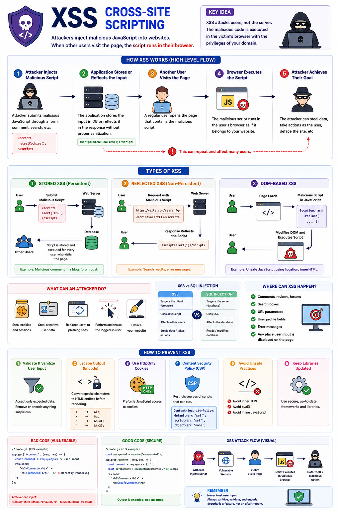

Ever wondered how a comment box can become a security vulnerability? 🤔

That's exactly what **XSS (Cross-Site Scripting)** is.

Instead of injecting SQL into your database, an attacker injects **malicious JavaScript** into your website.

When another user visits the page, that script runs **inside their browser**.

### How XSS Works

1️⃣ User submits malicious JavaScript through an input field.

2️⃣ The application stores or reflects that input without proper sanitization.

3️⃣ Another user opens the page.

4️⃣ The browser executes the malicious script as if it were part of your website.

5️⃣ The attacker can steal data or perform actions on behalf of the user.

---

### Types of XSS

🔹 **Stored XSS**
Malicious script is stored in the database and executed whenever users load the page.

🔹 **Reflected XSS**
The script is included in a URL or request and immediately reflected back in the response.

🔹 **DOM-Based XSS**
The vulnerability exists entirely on the client side, where JavaScript modifies the DOM using untrusted input.

---

### What Can an Attacker Do?

❌ Steal session cookies (if not `HttpOnly`)

❌ Read sensitive user data

❌ Redirect users to phishing websites

❌ Perform actions as the logged-in user

❌ Deface your website

---

### How to Prevent XSS

✅ Validate and sanitize all user input.

✅ Escape HTML before rendering user-generated content.

✅ Use `HttpOnly` cookies.

✅ Enable a strong **Content Security Policy (CSP)**.

✅ Avoid `innerHTML`; prefer `textContent` or safe templating libraries.

---

XSS isn't about breaking your server—it's about **tricking the browser into trusting malicious code**.

One overlooked input field can put every user at risk.

Have you ever encountered an XSS vulnerability while building an application?

👇 Share your experience!

#JavaScript #NodeJS #WebSecurity #XSS #Backend #Frontend #CyberSecurity #WebDevelopment #SoftwareEngineering #Programming
