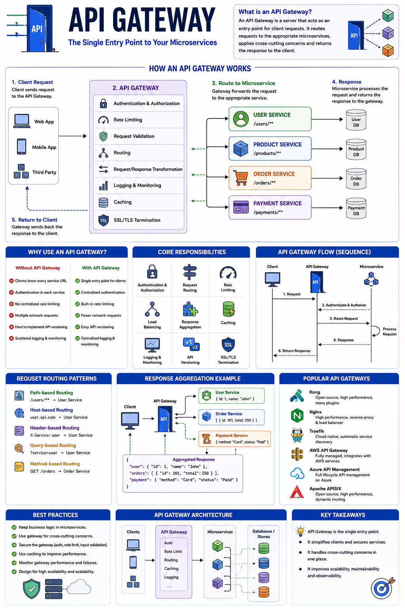

Imagine you have **20 microservices**.

Your frontend needs data from:

* User Service
* Product Service
* Order Service
* Payment Service
* Notification Service

Should the frontend call all of them directly?

Probably not.

That's where an **API Gateway** comes in. 🚪

An API Gateway acts as a **single entry point** for all client requests.

Instead of talking to every microservice individually, clients communicate with the gateway, and the gateway routes requests to the appropriate service.

---

## How an API Gateway Works

1️⃣ Client sends a request to the API Gateway.

2️⃣ The gateway authenticates the request.

3️⃣ It applies rate limiting and other security checks.

4️⃣ The request is routed to the correct microservice.

5️⃣ The microservice processes the request.

6️⃣ The response is returned through the gateway to the client.

---

## Why Use an API Gateway?

Without an API Gateway:

❌ Frontend needs to know every service URL.

❌ Authentication is duplicated across services.

❌ Each service implements its own rate limiting.

❌ Clients make multiple requests to different services.

With an API Gateway:

✅ One endpoint for all clients.

✅ Centralized authentication & authorization.

✅ Built-in rate limiting.

✅ Request routing and load balancing.

✅ Response aggregation.

✅ API versioning.

✅ Request logging and monitoring.

---

## Common Responsibilities

🔐 Authentication & Authorization

⚖️ Load Balancing

🚦 Rate Limiting

🔀 Request Routing

📦 Response Aggregation

📝 Logging & Monitoring

🔄 API Versioning

🛡️ SSL/TLS Termination

---

## Example

Instead of:

```text
Frontend
 ├── User Service
 ├── Product Service
 ├── Order Service
 └── Payment Service
```

Use:

```text
Frontend
     │
API Gateway
     │
 ├── User Service
 ├── Product Service
 ├── Order Service
 └── Payment Service
```

Now the frontend only communicates with **one endpoint**.

---

## Popular API Gateways

* Nginx
* Kong
* Traefik
* Apache APISIX
* AWS API Gateway
* Azure API Management

---

## Best Practices

✅ Keep business logic inside microservices.

✅ Let the gateway handle cross-cutting concerns (auth, logging, rate limiting).

✅ Avoid making the gateway a bottleneck.

✅ Monitor gateway performance and failures.

---

An API Gateway isn't just a router—it's the **front door of your microservices architecture**, making your system more secure, scalable, and easier to manage.

Are you using an API Gateway in your projects?

👇 Which one do you prefer?

#Microservices #APIGateway #NodeJS #Backend #SystemDesign #JavaScript #SoftwareEngineering #WebDevelopment #Cloud #Architecture
