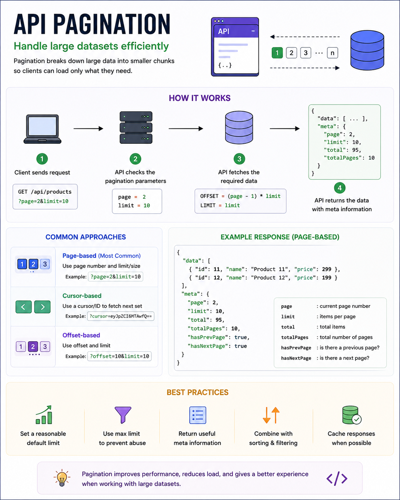

Imagine your database has **5 million products**.

Should your API return all 5 million records in a single response?

Absolutely not. 🚫

It would:

❌ Slow down your server

❌ Consume unnecessary bandwidth

❌ Increase memory usage

❌ Create a poor user experience

That's why we use **API Pagination**.

Pagination allows clients to request **only the data they need**, making APIs faster, more scalable, and easier to consume.

---

## What is API Pagination?

Pagination is the process of splitting a large dataset into **smaller, manageable pages**.

Instead of returning everything:

```http id="a1b2c3"
GET /api/products
```

Clients request a specific page:

```http id="d4e5f6"
GET /api/products?page=2&limit=10
```

The API returns only 10 products from page 2.

---

## How It Works

1️⃣ Client requests a page.

2️⃣ API reads the pagination parameters (`page` and `limit`).

3️⃣ Database fetches only the required records.

4️⃣ API returns the data along with pagination metadata.

Example response:

```json id="g7h8i9"
{
  "data": [...],
  "meta": {
    "page": 2,
    "limit": 10,
    "total": 95,
    "totalPages": 10,
    "hasPrevPage": true,
    "hasNextPage": true
  }
}
```

The metadata helps the frontend build pagination controls without extra requests.

---

## Common Pagination Strategies

### 1️⃣ Page-Based Pagination (Most Common)

```http id="j1k2l3"
GET /products?page=2&limit=20
```

✔ Easy to implement

✔ Great for admin dashboards and e-commerce apps

---

### 2️⃣ Offset-Based Pagination

```http id="m4n5o6"
GET /products?offset=40&limit=20
```

Useful when you want to skip a specific number of records.

However, large offsets can become slow on very large datasets.

---

### 3️⃣ Cursor-Based Pagination

```http id="p7q8r9"
GET /products?cursor=eyJpZCI6MTAwfQ==
```

Instead of page numbers, the API returns a cursor pointing to the next set of records.

✔ Faster for large datasets

✔ Preferred for infinite scrolling and social media feeds

---

## Why Pagination Matters

✅ Faster API responses

✅ Lower database load

✅ Reduced network usage

✅ Better user experience

✅ Easier frontend rendering

Without pagination, even a simple API can become a performance bottleneck as your data grows.

---

## Best Practices

✅ Set a reasonable default limit (e.g., 10–50 items).

✅ Enforce a maximum limit to prevent abuse.

✅ Return pagination metadata (`total`, `page`, `hasNextPage`, etc.).

✅ Combine pagination with filtering and sorting.

✅ Use database indexes on columns used for sorting and filtering.

✅ Consider cursor-based pagination for very large datasets.

---

## Pagination vs Infinite Scroll

📄 **Pagination**

* Best for search results, admin panels, and reports.
* Users can jump directly to a page.

♾️ **Infinite Scroll**

* Best for social media feeds and content discovery.
* Often powered by **cursor-based pagination** behind the scenes.

---

A simple way to remember it:

📦 **Pagination doesn't reduce your data—it reduces the amount of data transferred at one time.**

That's what makes APIs fast, scalable, and user-friendly.

Which pagination strategy do you use most often?

🔹 Page-Based

🔹 Offset-Based

🔹 Cursor-Based

👇 Let me know in the comments!

#NodeJS #JavaScript #Backend #API #Pagination #RESTAPI #WebDevelopment #SystemDesign #SoftwareEngineering #Programming


