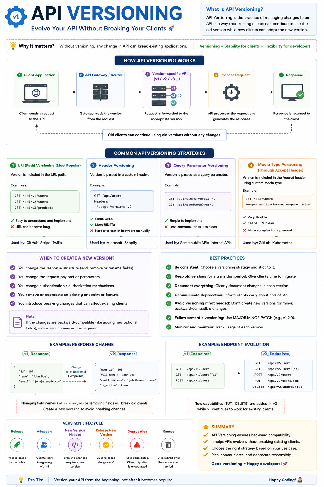

Imagine you launch an API...

Thousands of developers integrate it into their applications.

A few months later, you need to change the response format or remove a field.

What happens?

💥 You break every client using your API.

That's exactly why **API Versioning** exists.

It allows your API to evolve without breaking existing applications.

### Example

Instead of replacing your old endpoint:

❌

```http
GET /users
```

Create a new version:

✅

```http
GET /api/v1/users
GET /api/v2/users
```

Now:

* Existing clients continue using **v1**
* New clients can adopt **v2**
* Everyone gets time to migrate safely

---

### Common API Versioning Strategies

**1️⃣ URI Versioning (Most Popular)**

```http
/api/v1/users
/api/v2/users
```

✔ Easy to understand
✔ Easy to document
✔ Widely used

---

**2️⃣ Header Versioning**

```http
Accept-Version: v2
```

✔ Clean URLs
✔ More RESTful
❌ Harder to test manually

---

**3️⃣ Query Parameter Versioning**

```http
/users?version=2
```

✔ Simple
❌ Less common in production

---

**4️⃣ Media Type Versioning**

```http
Accept: application/vnd.company.v2+json
```

✔ Flexible
✔ Enterprise-friendly
❌ More complex

---

### When should you create a new API version?

✅ Changing response structure

✅ Removing or renaming fields

✅ Modifying request payloads

✅ Changing authentication behavior

✅ Introducing breaking changes

For **backward-compatible** additions (like adding optional fields), you often don't need a new version.

---

### Best Practices

✅ Keep old versions available for a transition period.

✅ Clearly document deprecated endpoints.

✅ Give clients enough time to migrate.

✅ Avoid unnecessary breaking changes.

✅ Follow semantic versioning for your API releases.

---

A well-versioned API allows your backend to evolve while keeping existing clients running smoothly.

The best APIs don't just work today—they continue working years later.

Which API versioning strategy do you prefer in production?

🔹 URI (`/v1/users`)
🔹 Header
🔹 Media Type
🔹 Query Parameters

👇 Let's discuss.

#API #Backend #NodeJS #JavaScript #RESTAPI #WebDevelopment #SoftwareEngineering #SystemDesign #Microservices #Programming

