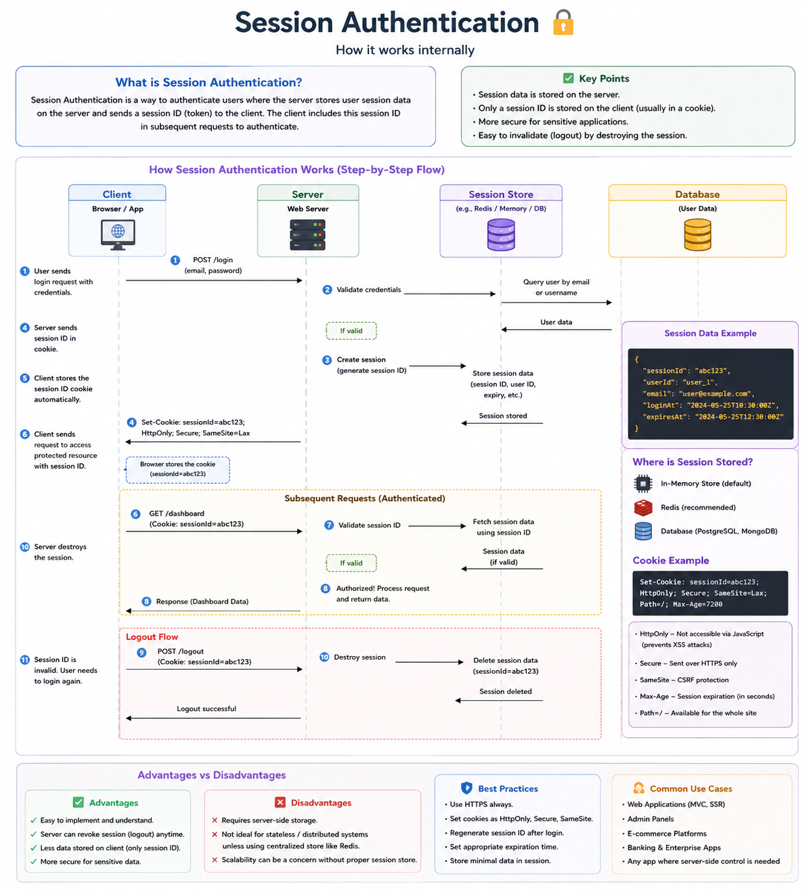
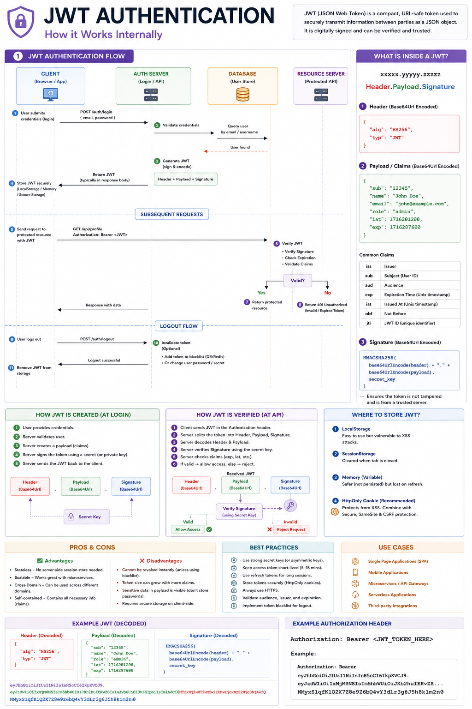
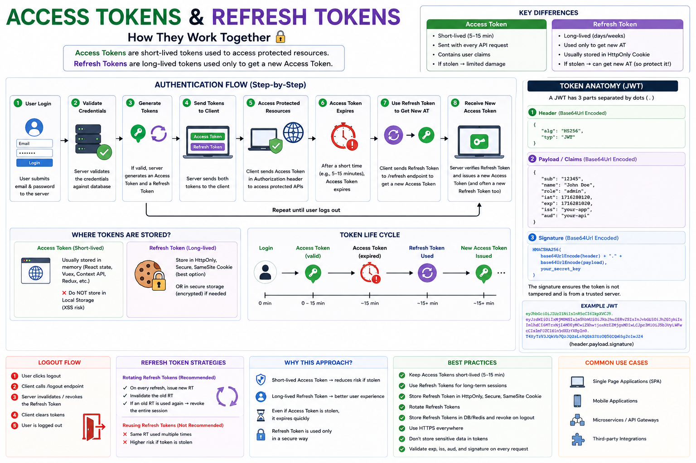

Ever wondered what actually happens after you click **"Login"**?

It feels instant...

But behind the scenes, **Session Authentication** performs several steps to verify your identity and keep you logged in securely. 🔐

Here's what happens:

1️⃣ You submit your email & password.

2️⃣ The server verifies your credentials against the database.

3️⃣ If they're valid, the server creates a unique **Session ID**.

4️⃣ Your session data (user ID, expiration time, etc.) is stored on the **server** (Memory, Redis, or Database).

5️⃣ The server sends only the **Session ID** back to your browser inside a secure cookie.

6️⃣ Every future request automatically includes that cookie.

7️⃣ The server looks up the Session ID, validates it, and identifies who you are—without asking you to log in again.

8️⃣ When you log out, the server simply destroys the session, making the Session ID useless.

💡 **Why is Session Authentication secure?**

✅ Sensitive user data never leaves the server.
✅ Cookies can be protected with `HttpOnly`, `Secure`, and `SameSite`.
✅ Logging out instantly invalidates the session.
✅ Even if someone knows your user ID, they still need the valid Session ID.

⚠️ **Best Practices**
• Store sessions in **Redis**, not memory, for production.
• Always use HTTPS.
• Enable `HttpOnly`, `Secure`, and `SameSite` cookies.
• Regenerate the Session ID after login to prevent Session Fixation attacks.
• Set an expiration time for every session.

Session Authentication has powered web applications for years because it's simple, reliable, and secure when implemented correctly.

What's your preferred authentication strategy for modern applications?

🔹 Session Authentication
🔹 JWT Authentication
🔹 OAuth
🔹 Something else?

👇 Let's discuss.

#NodeJS #Backend #Authentication #SessionAuthentication #WebDevelopment #JavaScript #ExpressJS #Redis #SoftwareEngineering #SystemDesign





JWT Authentication looks simple from the outside...

You log in.
You receive a token.
You access protected APIs.

But what actually happens behind the scenes? 🔐

Here's the complete flow:

1️⃣ You send your email & password to the authentication server.

2️⃣ The server validates your credentials.

3️⃣ If they're correct, the server creates a **JWT (JSON Web Token)** containing user information (called *claims*).

4️⃣ The token is digitally signed using the server's secret key, making it tamper-proof.

5️⃣ The JWT is returned to the client.

6️⃣ Every protected request includes the token in the Authorization header:

```http
Authorization: Bearer <JWT_TOKEN>
```

7️⃣ The server verifies:
✅ Token signature
✅ Expiration time
✅ Issuer & audience
✅ Claims

If everything is valid, access is granted.

---

📦 A JWT has 3 parts:

🔹 **Header**
Contains the algorithm and token type.

🔹 **Payload**
Contains claims like user ID, role, email, expiration, etc.

🔹 **Signature**
Generated using the Header + Payload + Secret Key to ensure the token hasn't been modified.

---

💡 Why developers love JWT

✅ Stateless authentication (no session storage)
✅ Great for REST APIs & Microservices
✅ Easy to scale horizontally
✅ Works well with mobile and SPAs
✅ Fast token verification

---

⚠️ Best Practices

• Keep Access Tokens short-lived (5–15 minutes).
• Use Refresh Tokens to issue new Access Tokens.
• Store tokens securely (prefer **HttpOnly Secure Cookies** over Local Storage).
• Always use HTTPS.
• Never store sensitive information (passwords, secrets) inside the JWT payload.
• Validate expiration (`exp`), issuer (`iss`), and audience (`aud`) on every request.

JWT isn't encrypted—it's **signed**.

Anyone can decode the Header and Payload, but only the server can create a valid Signature.

That's the key difference every backend developer should know.

Which authentication strategy do you prefer for production applications?

🔹 JWT Authentication
🔹 Session Authentication
🔹 OAuth 2.0
🔹 Hybrid (JWT + Refresh Tokens)

👇 Share your thoughts!

#NodeJS #JavaScript #JWT #Authentication #Backend #WebDevelopment #ExpressJS #Microservices #SoftwareEngineering #SystemDesign





One of the biggest misconceptions about JWT authentication is this:

> "Why do we need both an Access Token and a Refresh Token?"

If Access Tokens can authenticate users, why introduce another token?

The answer is **security**. 🔐

Here's how they work together:

🟢 **Access Token**
• Short-lived (typically **5–15 minutes**)
• Sent with every protected API request
• Contains user claims (ID, role, permissions)
• If stolen, it has a limited lifetime

🟣 **Refresh Token**
• Long-lived (days, weeks, or even months)
• Used **only** to request a new Access Token
• Never sent with every API request
• Usually stored securely as an **HttpOnly, Secure Cookie**

---

### Authentication Flow

1️⃣ User logs in with email & password.

2️⃣ Server generates:
• Access Token
• Refresh Token

3️⃣ Client stores both tokens securely.

4️⃣ Every API request includes only the **Access Token**:

```http
Authorization: Bearer <ACCESS_TOKEN>
```

5️⃣ After a few minutes, the Access Token expires.

6️⃣ Instead of forcing the user to log in again, the client sends the **Refresh Token** to a `/refresh` endpoint.

7️⃣ Server verifies the Refresh Token.

8️⃣ If valid, it issues a **new Access Token** (and often a new Refresh Token too).

The user stays logged in without noticing anything.

---

### Why not make the Access Token last forever?

Because if an attacker steals it, they immediately gain access.

A short expiration dramatically reduces the attack window.

---

### Best Practices

✅ Keep Access Tokens short-lived (5–15 minutes)

✅ Store Refresh Tokens in **HttpOnly + Secure Cookies**

✅ Rotate Refresh Tokens after every refresh request

✅ Store Refresh Tokens in a database or Redis so they can be revoked

✅ Revoke Refresh Tokens on logout or password changes

✅ Always use HTTPS

---

### Easy way to remember:

🟢 **Access Token**
= Opens the door 🚪

🟣 **Refresh Token**
= Gets you a new key when the old one expires 🔑

This combination gives users a seamless login experience while significantly improving security.

How do you implement authentication in your applications?

🔹 JWT + Refresh Tokens
🔹 Session Authentication
🔹 OAuth 2.0
🔹 Another approach?

👇 I'd love to hear your thoughts.

#JavaScript #NodeJS #JWT #Authentication #Backend #WebDevelopment #Security #ExpressJS #SoftwareEngineering #SystemDesign
