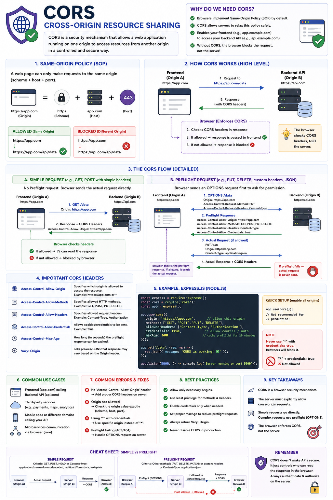

Have you ever seen this error?

❌ **"Access to fetch at 'https://api.example.com' from origin 'https://app.example.com' has been blocked by CORS policy."**

Every frontend developer has encountered it at least once.

Many think **CORS is a server security feature**.

It's not.

**CORS (Cross-Origin Resource Sharing)** is a **browser security mechanism** that controls whether JavaScript running on one website can access resources from another origin.

Let's understand what actually happens behind the scenes.

---

## First, What is an Origin?

An **Origin** is made up of three parts:

```
Protocol + Domain + Port
```

Example:

```
https://app.example.com:443
│        │             │
│        │             └── Port
│        └──────────────── Domain
└───────────────────────── Protocol
```

If **any one** of these changes, the origin changes.

Example:

✅ Same Origin

```
https://app.example.com
https://app.example.com
```

❌ Different Origin

```
https://app.example.com
https://api.example.com
```

Different subdomain.

---

```
https://app.example.com
http://app.example.com
```

Different protocol.

---

```
https://app.example.com:3000
https://app.example.com:5000
```

Different port.

---

## Why Does CORS Exist?

Imagine you're logged into your bank.

At the same time, you visit a malicious website.

Without CORS, that website's JavaScript could silently make requests to your bank's API and read sensitive information using your authenticated session.

To prevent this, browsers enforce the **Same-Origin Policy (SOP)**.

By default:

✔ JavaScript can only read responses from the **same origin**.

Everything else is blocked unless the server explicitly allows it.

---

## How CORS Works

Imagine:

Frontend:

```
https://app.example.com
```

Backend:

```
https://api.example.com
```

### Step 1

Browser sends the request.

```
GET /users
Origin: https://app.example.com
```

Notice the browser automatically includes:

```
Origin
```

header.

---

### Step 2

Backend checks whether this origin is allowed.

If allowed, it responds with:

```
Access-Control-Allow-Origin:
https://app.example.com
```

---

### Step 3

The browser checks the response header.

If it matches the request origin:

✅ JavaScript receives the response.

Otherwise:

❌ Browser blocks access.

The important thing:

**The API still processed the request.**

Only the browser prevented JavaScript from reading the response.

---

## Simple Requests vs Preflight Requests

### Simple Request

Examples:

* GET
* POST
* HEAD

with simple headers.

Browser sends the actual request immediately.

```
Browser
   │
GET /users
   │
Server
   │
Response + CORS Headers
   │
Browser checks headers
```

---

### Preflight Request

Some requests are considered "complex."

Examples:

* PUT
* PATCH
* DELETE

or

```
Authorization
```

header

or

```
Content-Type:
application/json
```

Before sending the real request, the browser first sends:

```
OPTIONS
```

request.

Example:

```
OPTIONS /users
Origin: https://app.example.com
Access-Control-Request-Method: PUT
```

---

Server replies:

```
Access-Control-Allow-Origin

Access-Control-Allow-Methods

Access-Control-Allow-Headers
```

If everything is allowed:

✅ Browser sends the actual PUT request.

Otherwise:

❌ Request never leaves the browser.

---

## Important CORS Headers

### Access-Control-Allow-Origin

Defines which origins are allowed.

```
Access-Control-Allow-Origin:
https://app.example.com
```

---

### Access-Control-Allow-Methods

Allowed HTTP methods.

```
GET, POST, PUT, DELETE
```

---

### Access-Control-Allow-Headers

Allowed request headers.

```
Authorization
Content-Type
```

---

### Access-Control-Allow-Credentials

Allows cookies and credentials.

```
true
```

Important:

```
Access-Control-Allow-Origin: *
```

cannot be used together with

```
credentials: true
```

Browsers will reject it.

---

### Access-Control-Max-Age

Caches preflight responses.

This avoids sending OPTIONS requests repeatedly.

---

## Express.js Example

```javascript
import cors from "cors";

app.use(
  cors({
    origin: "https://app.example.com",
    methods: ["GET", "POST", "PUT", "DELETE"],
    credentials: true,
    allowedHeaders: [
      "Content-Type",
      "Authorization",
    ],
  })
);
```

Avoid:

```javascript
app.use(cors());
```

in production.

It allows every origin.

---

## Common Mistakes

❌ Allowing every origin in production

❌ Forgetting OPTIONS requests

❌ Using "*" with credentials

❌ Assuming CORS protects APIs

❌ Disabling browser security to "fix" CORS

---

## Best Practices

✅ Allow only trusted origins.

✅ Whitelist frontend domains.

✅ Use HTTPS.

✅ Keep allowed methods minimal.

✅ Keep allowed headers minimal.

✅ Enable credentials only when necessary.

✅ Cache preflight requests with `Access-Control-Max-Age`.

---

## CORS vs API Security

One of the biggest misconceptions:

**CORS does NOT secure your API.**

It only tells **browsers** whether JavaScript is allowed to read responses.

Clients like:

* Postman
* cURL
* Mobile Apps
* Backend Servers

do **not** enforce CORS.

That's why you still need:

✅ Authentication

✅ Authorization

✅ Rate Limiting

✅ Input Validation

✅ CSRF Protection (when using cookies)

---

## Easy Way to Remember

🟢 **Same-Origin Policy**

Browser blocks cross-origin requests by default.

⬇️

🟢 **CORS**

Server tells the browser:

> "Yes, this origin is allowed to access my resources."

The browser then decides whether JavaScript can read the response.

Understanding CORS is essential for every full-stack developer because almost every modern web application has a frontend and backend running on different origins during development or in production.

Have you ever spent hours debugging a CORS error that turned out to be a missing header or misconfigured origin?

👇 Share your experience!

#NodeJS #JavaScript #Backend #Frontend #CORS #ExpressJS #WebDevelopment #API #SoftwareEngineering #Programming
