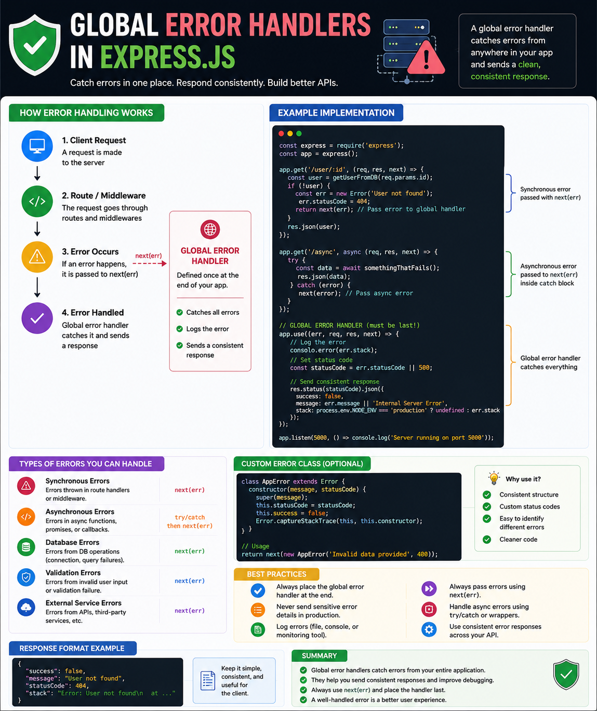

Have you ever wrapped every route in a `try...catch` block?

```js
try {
  // business logic
} catch (err) {
  res.status(500).json({
    message: "Something went wrong"
  });
}
```

Now imagine doing that in **100+ routes**.

That's repetitive, difficult to maintain, and easy to get wrong.

This is exactly why **Global Error Handlers** exist in Express.js. 🛡️

---

## What is a Global Error Handler?

A Global Error Handler is a special middleware that catches errors from anywhere in your application and returns a **consistent error response**.

Instead of handling errors inside every controller, you centralize them in one place.

---

## How It Works

A request flows like this:

```text
Client Request
      │
      ▼
Middleware
      │
      ▼
Route Handler
      │
      ▼
Error Occurs
      │
 next(error)
      ▼
Global Error Handler
      │
      ▼
HTTP Response
```

No matter where the error happens, it eventually reaches the same handler.

---

## Express Error Middleware

Unlike normal middleware:

```js
(req, res, next)
```

An error-handling middleware has **four parameters**:

```js
(err, req, res, next) => {
  res.status(500).json({
    success: false,
    message: err.message,
  });
}
```

Express recognizes it as an error handler because of the first `err` parameter.

---

## Passing Errors

Instead of responding everywhere:

```js
return res.status(404).json({
  message: "User not found",
});
```

Simply throw or forward the error:

```js
next(new Error("User not found"));
```

The global handler takes care of the response.

---

## Why Use a Global Error Handler?

✅ One place to handle all errors

✅ Consistent API response format

✅ Cleaner route handlers

✅ Easier debugging

✅ Centralized logging

✅ Easier maintenance

---

## Common Errors You Can Handle

🔹 Validation Errors

🔹 Authentication Errors

🔹 Authorization Errors

🔹 Database Errors

🔹 File Upload Errors

🔹 External API Errors

🔹 Unexpected Server Errors

Instead of every route deciding how to respond, the global handler does it consistently.

---

## Example Response

```json
{
  "success": false,
  "message": "User not found"
}
```

Every endpoint returns the same response structure, making it easier for frontend applications to handle errors.

---

## Best Practices

✅ Register the global error handler **last**.

✅ Use custom error classes for different error types.

✅ Log errors for debugging and monitoring.

✅ Hide stack traces in production.

✅ Return meaningful HTTP status codes.

✅ Keep a consistent error response format across your API.

---

## Common Mistakes

❌ Returning different error formats from different routes.

❌ Forgetting to call `next(err)`.

❌ Exposing stack traces in production.

❌ Catching every error but never logging it.

❌ Putting business logic inside the error handler.

---

## A Simple Rule to Remember

Normal middleware handles **successful requests**.

Global error middleware handles **failed requests**.

Instead of writing error-handling code in every controller, let one centralized middleware do the work.

That's how production-grade Express applications stay clean, maintainable, and consistent.

How do you handle errors in your Express applications?

🔹 Global Error Handler

🔹 Custom Error Classes

🔹 express-async-errors

🔹 Custom Wrapper Functions

👇 Share your approach!

#NodeJS #ExpressJS #JavaScript #Backend #ErrorHandling #API #WebDevelopment #SoftwareEngineering #Programming #SystemDesign


