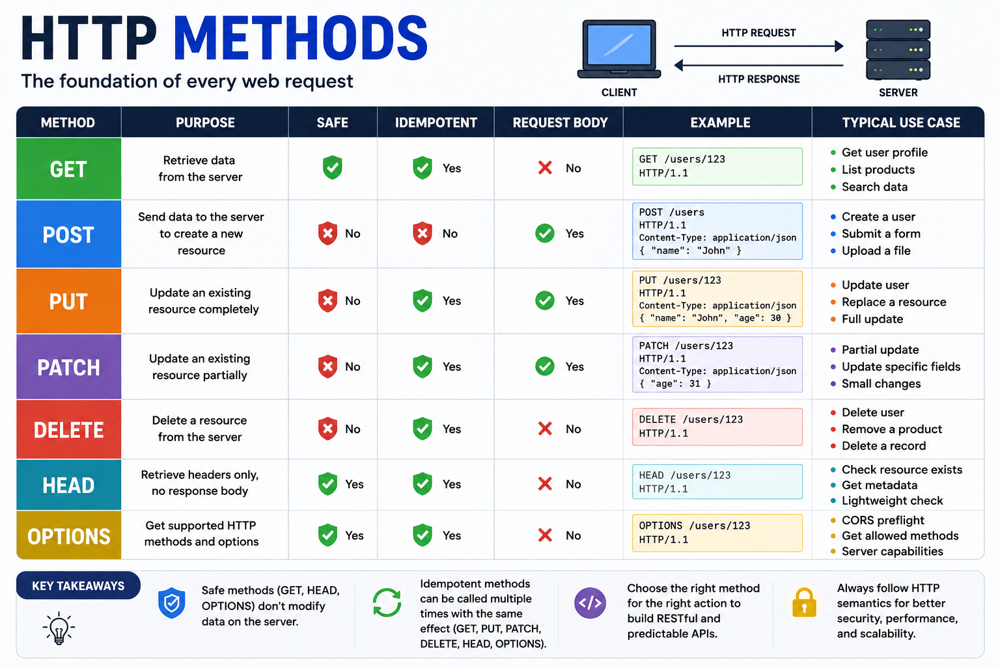

Every API request starts with one simple question:

**What do you want to do with this resource?**

The answer is defined by the **HTTP Method**.

Choosing the right method isn't just about following conventions—it's what makes APIs predictable, scalable, and easy to understand.

Let's break them down. 👇

---

## 🌐 What are HTTP Methods?

HTTP methods tell the server **what action** should be performed on a resource.

Think of them as **verbs** for your API.

For example:

```
GET    /users
POST   /users
PUT    /users/1
PATCH  /users/1
DELETE /users/1
```

Same resource.

Different action.

---

## 🟢 GET – Retrieve Data

Used to fetch data from the server.

Example:

```http
GET /api/users
```

Common use cases:

✅ Get all users

✅ Get a product

✅ Search data

Important:

* Should **not modify** data.
* Usually doesn't have a request body.
* Can be cached.

---

## 🔵 POST – Create a Resource

Used to create new data.

Example:

```http
POST /api/users
```

Request Body:

```json
{
  "name": "John",
  "email": "john@example.com"
}
```

Common use cases:

✅ User registration

✅ Create an order

✅ Upload a file

Each request may create a new resource.

---

## 🟠 PUT – Replace a Resource

Used to completely replace an existing resource.

Example:

```http
PUT /api/users/1
```

```json
{
  "name": "John",
  "email": "john@example.com",
  "age": 25
}
```

Think of PUT as:

> "Replace everything with this new version."

---

## 🟣 PATCH – Update Part of a Resource

Used when only a few fields need to change.

Example:

```http
PATCH /api/users/1
```

```json
{
  "age": 26
}
```

Only the provided fields are updated.

Ideal for partial updates.

---

## 🔴 DELETE – Remove a Resource

Deletes an existing resource.

Example:

```http
DELETE /api/users/1
```

Common use cases:

✅ Delete a user

✅ Remove a product

✅ Cancel an order

Many production systems use **Soft Delete** instead of permanently deleting data.

---

## 🔹 HEAD – Get Headers Only

Works like GET, but returns only the response headers.

No response body.

Useful for:

* Checking if a resource exists
* Reading metadata
* Verifying file size

---

## 🟡 OPTIONS – Discover Supported Methods

Returns the HTTP methods supported by a resource.

Example:

```http
OPTIONS /api/users
```

Often used by browsers during a **CORS Preflight Request**.

---

## Safe vs Idempotent Methods

These terms often appear in interviews.

### 🛡️ Safe Methods

Safe methods do **not change** server data.

Examples:

✅ GET

✅ HEAD

✅ OPTIONS

---

### 🔁 Idempotent Methods

Calling the same request multiple times produces the **same result**.

Examples:

✅ GET

✅ PUT

✅ PATCH *(if implemented correctly)*

✅ DELETE

Example:

```http
DELETE /users/1
```

The first request deletes the user.

The second request doesn't delete anything else.

The end result is the same.

POST is **not idempotent** because each request can create a new resource.

---

## Quick Comparison

| Method  | Purpose           | Request Body | Safe | Idempotent |
| ------- | ----------------- | ------------ | ---- | ---------- |
| GET     | Read data         | ❌            | ✅    | ✅          |
| POST    | Create            | ✅            | ❌    | ❌          |
| PUT     | Replace           | ✅            | ❌    | ✅          |
| PATCH   | Partial update    | ✅            | ❌    | Usually ✅  |
| DELETE  | Delete            | Usually ❌    | ❌    | ✅          |
| HEAD    | Headers only      | ❌            | ✅    | ✅          |
| OPTIONS | Supported methods | ❌            | ✅    | ✅          |

---

## Best Practices

✅ Use the correct HTTP method for the correct action.

✅ Don't modify data with GET requests.

✅ Use PATCH for partial updates.

✅ Keep APIs consistent.

✅ Return appropriate HTTP status codes.

---

A simple way to remember them:

📖 **GET** → Read

➕ **POST** → Create

♻️ **PUT** → Replace

✏️ **PATCH** → Update

🗑️ **DELETE** → Remove

Mastering HTTP methods is one of the first steps toward designing clean, RESTful APIs that other developers will love to use.

Which HTTP method do you use most often in your backend projects?

👇 Let me know!

#HTTP #RESTAPI #NodeJS #Backend #JavaScript #WebDevelopment #SoftwareEngineering #API #Programming #ExpressJS
