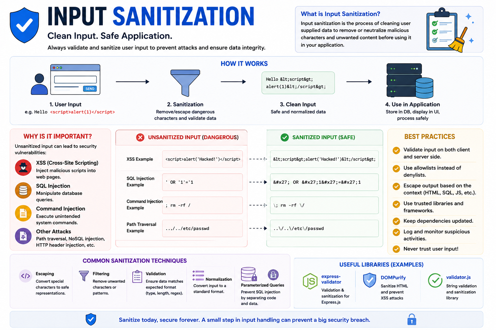

Most security vulnerabilities don't start with sophisticated hackers...

They start with **user input**.

A search box.

A login form.

A comment section.

A contact form.

If you trust user input without cleaning it you're inviting attackers into your application.

That's why **Input Sanitization** is an essential part of backend security. 🛡️

---

## What is Input Sanitization?

Input sanitization is the process of **cleaning or transforming user input** before using or storing it.

The goal is to remove or neutralize potentially harmful content while keeping valid data intact.

For example, if a user submits:

```html
<script>alert("Hacked!")</script>
```

A sanitization library might escape it as:

```html
&lt;script&gt;alert("Hacked!")&lt;/script&gt;
```

Now it's treated as plain text instead of executable JavaScript.

---

## How It Works

1️⃣ User submits data.

2️⃣ Server validates the input format.

3️⃣ Server sanitizes the input by removing or escaping dangerous content.

4️⃣ Clean data is processed or stored.

Simple flow:

```id="m9x3q7"
User Input
     │
     ▼
Validation
     │
     ▼
Sanitization
     │
     ▼
Business Logic
     │
     ▼
Database
```

Validation and sanitization work together—but they solve different problems.

---

## Validation vs Sanitization

These terms are often confused.

### ✅ Validation

Checks **whether the input is valid**.

Examples:

* Is the email format correct?
* Is the password at least 8 characters?
* Is age a positive number?

If validation fails:

❌ Reject the request.

---

### 🧹 Sanitization

Cleans the input **before using it**.

Examples:

* Escape HTML
* Trim whitespace
* Remove dangerous characters
* Normalize text

Validation asks:

> "Is this input acceptable?"

Sanitization asks:

> "How can I make this input safe?"

You usually need **both**.

---

## Why is Sanitization Important?

Unsanitized input can lead to:

❌ Cross-Site Scripting (XSS)

❌ SQL Injection

❌ NoSQL Injection

❌ Command Injection

❌ HTML Injection

❌ Path Traversal

One vulnerable input field can compromise your entire application.

---

## Common Sanitization Techniques

### 1. Escape HTML

Convert special characters into safe HTML entities.

```html
<
>
&
"
'
```

becomes:

```html
&lt;
&gt;
&amp;
&quot;
&#39;
```

---

### 2. Trim Whitespace

```text
"   John Doe   "
```

↓

```text
"John Doe"
```

---

### 3. Normalize Input

Convert values into a consistent format.

Example:

```text
JOHN@EXAMPLE.COM
```

↓

```text
john@example.com
```

---

### 4. Remove Unexpected Characters

Accept only characters your application actually needs.

Example:

```text
Phone Number:
Only digits allowed
```

---

## Where Should You Sanitize?

✅ User names

✅ Comments

✅ Search queries

✅ Contact forms

✅ URLs

✅ HTML content

Basically...

Any data coming from users should be treated as **untrusted**.

---

## Best Practices

✅ Validate before processing.

✅ Sanitize before storing or rendering data.

✅ Escape output based on context (HTML, SQL, URLs, JSON).

✅ Use trusted libraries instead of writing your own sanitizers.

✅ Apply server-side sanitization even if the frontend already validates.

✅ Keep dependencies updated.

---

## Common Mistakes

❌ Trusting frontend validation.

❌ Assuming internal users can't submit malicious input.

❌ Building SQL queries with raw input.

❌ Rendering user-generated HTML without escaping.

❌ Creating custom sanitization logic instead of using well-tested libraries.

---

## Helpful Libraries

For Node.js:

📦 **validator.js** – String validation and sanitization

📦 **express-validator** – Validation middleware for Express

📦 **DOMPurify** – Sanitizes HTML to prevent XSS (commonly used on the frontend)

Always choose libraries that are actively maintained and widely adopted.

---

## A Simple Rule to Remember

🔒 **Validate what you expect.**

🧹 **Sanitize what you receive.**

🚫 **Never trust user input.**

That's the foundation of building secure web applications.

A few extra lines of validation and sanitization today can prevent major security incidents tomorrow.

How do you handle input sanitization in your backend projects?

🔹 express-validator

🔹 validator.js

🔹 Zod

🔹 Joi

🔹 Another approach?

👇 Share your preferred tools!

#NodeJS #JavaScript #Backend #WebSecurity #InputSanitization #Validation #ExpressJS #CyberSecurity #SoftwareEngineering #WebDevelopment
