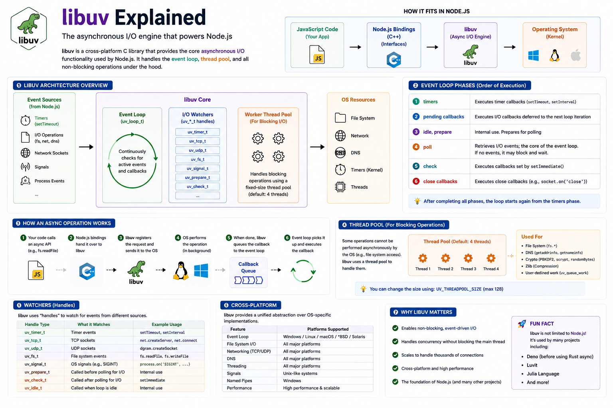

When people say:

> **"Node.js is non-blocking."**

What actually makes that possible?

The answer isn't JavaScript.

It isn't the V8 engine.

It's **libuv**.

libuv is one of the most important pieces of Node.js, yet many developers use Node for years without knowing what it does.

Let's fix that. 👇

---

## What is libuv?

**libuv** is a **cross-platform C library** that powers Node.js's asynchronous I/O.

It provides the features that make Node.js fast and scalable, including:

✅ Event Loop

✅ Asynchronous File I/O

✅ Networking

✅ Timers

✅ Thread Pool

Without libuv, Node.js would block whenever it performed slow operations like reading files or querying a database.

---

## Where Does libuv Fit?

When your code calls:

```javascript id="x8d3kp"
fs.readFile("users.json", callback);
```

It doesn't directly access the operating system.

Instead, the request travels through several layers:

```text id="z6m4qh"
JavaScript
      │
      ▼
V8 Engine
      │
      ▼
Node.js APIs
      │
      ▼
C++ Bindings
      │
      ▼
libuv
      │
      ▼
Operating System
```

libuv acts as the bridge between Node.js and the OS.

---

## What Does libuv Handle?

libuv is responsible for:

📁 File System operations

🌐 Network sockets

⏰ Timers (`setTimeout`, `setInterval`)

📡 DNS lookups

🧵 Thread Pool

🔄 Event Loop

Signal handling

Child processes

It manages almost every asynchronous operation inside Node.js.

---

## How libuv Works

Imagine your application needs to read a large file.

Step 1️⃣

Your JavaScript code calls:

```javascript id="f4q8zt"
fs.readFile(...)
```

---

Step 2️⃣

The request goes through Node.js APIs and C++ bindings to libuv.

---

Step 3️⃣

libuv delegates the work to:

* Operating System

or

* Thread Pool

depending on the operation.

JavaScript continues executing other code.

It never waits.

---

Step 4️⃣

Once the operation completes:

The callback is placed into the Callback Queue.

---

Step 5️⃣

The Event Loop notices the Call Stack is empty.

It moves the callback onto the Call Stack.

Finally:

```javascript id="y2h5wr"
callback();
```

executes.

This entire process happens without blocking your application.

---

## libuv Thread Pool

Some operations can't be handled asynchronously by the operating system.

Examples include:

📁 File System operations

🔐 Cryptography

🗜️ Compression (zlib)

🌐 Certain DNS operations

For these tasks, libuv uses a **Thread Pool**.

By default:

```text id="a7w3nm"
4 Threads
```

Each thread can handle one blocking task.

The pool size can be increased with:

```bash id="m9k6qb"
UV_THREADPOOL_SIZE
```

for workloads that benefit from additional threads.

---

## Event Loop + libuv

The Event Loop and libuv work together.

Think of it like this:

```text id="d3p8jy"
JavaScript
      │
      ▼
Call Stack
      │
      ▼
libuv handles async work
      │
      ▼
Operation completes
      │
      ▼
Callback Queue
      │
      ▼
Event Loop
      │
      ▼
Call Stack
```

The Event Loop doesn't perform the work.

It simply decides **when callbacks should execute**.

libuv performs the heavy lifting behind the scenes.

---

## Why libuv is Important

Without libuv:

❌ Every file read would block JavaScript.

❌ Every database query would freeze the server.

❌ Every HTTP request would wait for previous requests to finish.

Instead, Node.js remains responsive because libuv offloads slow operations while JavaScript keeps processing new requests.

---

## Common Operations Using libuv

✅ `fs.readFile()`

✅ `fs.writeFile()`

✅ `setTimeout()`

✅ `setInterval()`

✅ Network sockets

✅ HTTP requests

✅ DNS lookups

✅ `crypto.pbkdf2()`

✅ `zlib` compression

These operations all rely on libuv in some way.

---

## Common Misconceptions

❌ libuv makes JavaScript multi-threaded.

→ JavaScript still runs on a single main thread.

---

❌ The Event Loop performs file operations.

→ libuv performs the I/O.

The Event Loop only schedules callbacks.

---

❌ Everything runs inside the Thread Pool.

→ Many network operations are handled efficiently by the operating system. The thread pool is mainly used for operations that would otherwise block, such as file system access, certain DNS lookups, crypto, and compression.

---

## Best Practices

✅ Prefer asynchronous APIs over synchronous ones.

✅ Avoid blocking the Event Loop with CPU-intensive work.

✅ Use Worker Threads for heavy computations.

✅ Understand which APIs rely on the Thread Pool.

✅ Monitor thread pool usage in I/O-heavy applications.

---

## A Simple Way to Remember

🧠 **V8** → Executes JavaScript.

🔗 **Node.js APIs** → Expose system functionality to JavaScript.

⚙️ **C++ Bindings** → Connect JavaScript to native code.

⚡ **libuv** → Performs asynchronous work and manages the Event Loop.

💻 **Operating System** → Executes low-level system operations.

libuv is the engine that allows Node.js to stay non-blocking and efficiently handle thousands of concurrent connections.

Once you understand libuv, the internals of Node.js become much easier to reason about.

Which Node.js internal topic would you like to explore next?

🔹 Worker Threads

🔹 Cluster Module

🔹 Streams

🔹 Buffer

🔹 Event Loop Phases

👇 Let me know!

#NodeJS #JavaScript #Backend #libuv #EventLoop #V8 #WebDevelopment #SoftwareEngineering #Programming #SystemDesign


