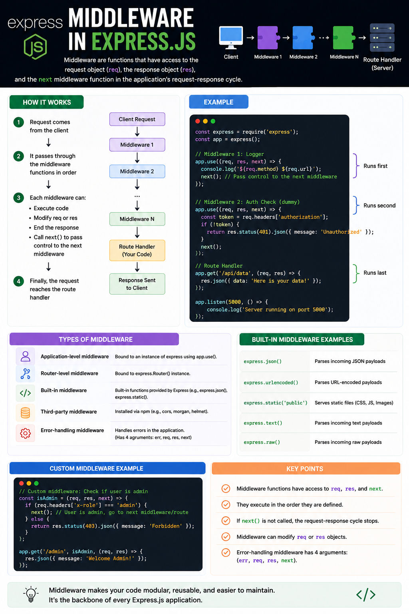

Ever wondered what happens **before** your Express.js route handler executes?

When a request reaches your server, it doesn't go directly to your route.

Instead, it passes through a series of **middleware functions**.

Think of middleware as **checkpoints** in your application's request-response lifecycle. 🚦

---

## What is Middleware?

Middleware is a function that has access to:

* `req` (Request)
* `res` (Response)
* `next` (Function to pass control to the next middleware)

```js id="rj9m2p"
(req, res, next) => {
  // Do something
  next();
}
```

Every incoming request travels through middleware before reaching the route handler.

---

## How Middleware Works

Imagine a client requests:

```http id="n8kq7x"
GET /api/users
```

The request flows like this:

```
Client
   │
   ▼
Logger Middleware
   │
   ▼
Authentication Middleware
   │
   ▼
Validation Middleware
   │
   ▼
Route Handler
   │
   ▼
Response
```

Each middleware gets a chance to inspect or modify the request before passing it along.

---

## What Can Middleware Do?

✅ Execute custom logic

✅ Read or modify `req` and `res`

✅ Authenticate users

✅ Validate request data

✅ Log incoming requests

✅ Parse JSON bodies

✅ Handle CORS

✅ End the request early

Or...

➡️ Call `next()` to continue to the next middleware.

---

## Example

```js id="q7m5bx"
app.use((req, res, next) => {
  console.log(`${req.method} ${req.url}`);
  next();
});
```

Every request is logged before reaching your routes.

Authentication middleware:

```js id="t2c9ny"
app.use((req, res, next) => {
  const token = req.headers.authorization;

  if (!token) {
    return res.status(401).json({
      message: "Unauthorized",
    });
  }

  next();
});
```

If no token exists, the request stops immediately.

Otherwise, it continues to the next middleware or route.

---

## Types of Middleware

### 1️⃣ Application-Level Middleware

Runs for the entire application.

```js id="m6v8kp"
app.use(express.json());
```

---

### 2️⃣ Router-Level Middleware

Runs only for specific routes.

```js id="b3x4qa"
router.use(authMiddleware);
```

---

### 3️⃣ Built-in Middleware

Provided by Express.

Examples:

* `express.json()`
* `express.urlencoded()`
* `express.static()`

---

### 4️⃣ Third-Party Middleware

Installed via npm.

Examples:

* `cors`
* `helmet`
* `morgan`
* `compression`

---

### 5️⃣ Error-Handling Middleware

Handles errors in one place.

```js id="v1d7re"
(err, req, res, next) => {
  res.status(500).json({
    message: err.message,
  });
}
```

Notice the extra `err` parameter.

---

## Why Middleware is Powerful

Without middleware, every route would need to repeat the same code.

Example:

❌ Authenticate user

❌ Validate request

❌ Log request

❌ Handle errors

...inside every route.

With middleware, write it **once** and reuse it everywhere.

This keeps your code:

✅ Cleaner

✅ Reusable

✅ Easier to maintain

---

## Common Middleware Stack

A typical Express application might look like:

```
Request
   │
   ▼
Helmet
   │
   ▼
CORS
   │
   ▼
express.json()
   │
   ▼
Logger
   │
   ▼
Authentication
   │
   ▼
Validation
   │
   ▼
Route Handler
   │
   ▼
Global Error Handler
   │
   ▼
Response
```

Each middleware has a single responsibility.

---

## Best Practices

✅ Keep middleware focused on one task.

✅ Always call `next()` unless you're sending a response.

✅ Register middleware in the correct order.

✅ Handle errors using centralized error middleware.

✅ Avoid putting business logic inside middleware.

---

## Common Mistakes

❌ Forgetting to call `next()`, causing requests to hang.

❌ Registering middleware in the wrong order.

❌ Writing large middleware that does too many things.

❌ Returning inconsistent error responses.

---

A simple way to remember it:

🚦 **Middleware is like a security checkpoint at an airport.**

Every request passes through multiple checkpoints before reaching its final destination.

Some requests move forward.

Some are rejected.

Some are modified along the way.

That's what makes Express applications modular, scalable, and easy to maintain.

What's your favorite middleware package in Express?

🔹 CORS

🔹 Helmet

🔹 Morgan

🔹 Compression

🔹 Custom Middleware

👇 Share yours!

#NodeJS #ExpressJS #JavaScript #Backend #Middleware #WebDevelopment #SoftwareEngineering #API #Programming #SystemDesign

