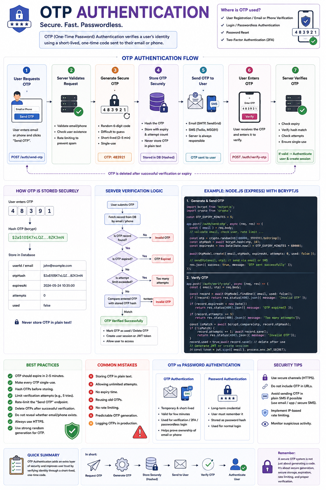

Have you ever wondered what happens after you click **"Send OTP"**?

Within seconds, a unique code appears in your email or SMS...

But behind the scenes, several security checks happen before you're authenticated. 🔐

**OTP (One-Time Password) Authentication** is widely used for login, signup verification, password resets, and two-factor authentication (2FA) because it proves that the user owns a specific email address or phone number.

Here's how it works.

---

## OTP Authentication Flow

### 1️⃣ User requests an OTP

The user enters their email or phone number and clicks **"Send OTP."**

```text
Email: john@example.com
```

The client sends a request to the backend.

```
POST /auth/send-otp
```

---

### 2️⃣ Server validates the request

Before generating an OTP, the server checks:

✅ Is the email/phone valid?

✅ Does the user exist? (Login)

OR

✅ Is the email already registered? (Signup)

It also applies **rate limiting** to prevent OTP spam.

---

### 3️⃣ Server generates a secure OTP

The backend generates a random code.

Example:

```
483921
```

A good OTP should be:

• Random

• Difficult to guess

• Short-lived

• Single-use

---

### 4️⃣ Store the OTP securely

Never store OTPs as plain text.

Instead:

* Hash the OTP (just like passwords)
* Store:

  * User ID / Email
  * Hashed OTP
  * Expiration Time
  * Attempt Count

Example:

```json
{
  "email": "john@example.com",
  "otpHash": "...",
  "expiresAt": "10:35 PM",
  "attempts": 0
}
```

---

### 5️⃣ Send the OTP

The backend sends the OTP using:

📧 Email (SMTP, Resend, SendGrid, etc.)

📱 SMS (Twilio, MSG91, etc.)

The client never generates the OTP.

The server is always responsible.

---

### 6️⃣ User enters the OTP

The user receives:

```
483921
```

and submits it.

```
POST /auth/verify-otp
```

---

### 7️⃣ Server verifies the OTP

The backend checks:

✅ Is the OTP expired?

✅ Does the hash match?

✅ Has it already been used?

✅ Has the user exceeded the maximum attempts?

If everything is valid:

✔ Authenticate the user

✔ Issue a Session or JWT

✔ Delete the OTP immediately

---

## Why Hash OTPs?

Many developers hash passwords but store OTPs in plain text.

That's risky.

If your database is leaked, attackers could immediately use valid OTPs that haven't expired.

Hashing OTPs prevents this.

---

## Best Practices

✅ OTP expires in **2–5 minutes**

✅ Make every OTP **single-use**

✅ Hash OTPs before storing them

✅ Limit verification attempts (e.g. 5 tries)

✅ Rate-limit the "Send OTP" endpoint

✅ Delete OTPs after successful verification

✅ Never expose whether an email exists when it's unnecessary (helps prevent user enumeration)

✅ Always use HTTPS

---

## Common Mistakes

❌ Storing OTPs in plain text

❌ Allowing unlimited verification attempts

❌ Reusing old OTPs

❌ No expiration time

❌ No rate limiting

❌ Predictable OTP generation

❌ Logging OTPs in production

---

## OTP Authentication vs Password Authentication

🔐 **Password Authentication**

• User remembers a password

• Long-term credential

• Stored as a password hash

📩 **OTP Authentication**

• Temporary credential

• Valid for only a few minutes

• Usually used for verification or passwordless login

Many modern applications combine both for stronger security.

---

A secure OTP system isn't just about generating a 6-digit code.

It's about secure generation, storage, expiration, rate limiting, hashing, and proper verification.

Get those right, and you've built an authentication flow users can trust.

Have you implemented OTP authentication in your projects?

👇 What provider or strategy do you use?

#NodeJS #JavaScript #Backend #Authentication #OTP #CyberSecurity #ExpressJS #JWT #SoftwareEngineering #WebDevelopment
