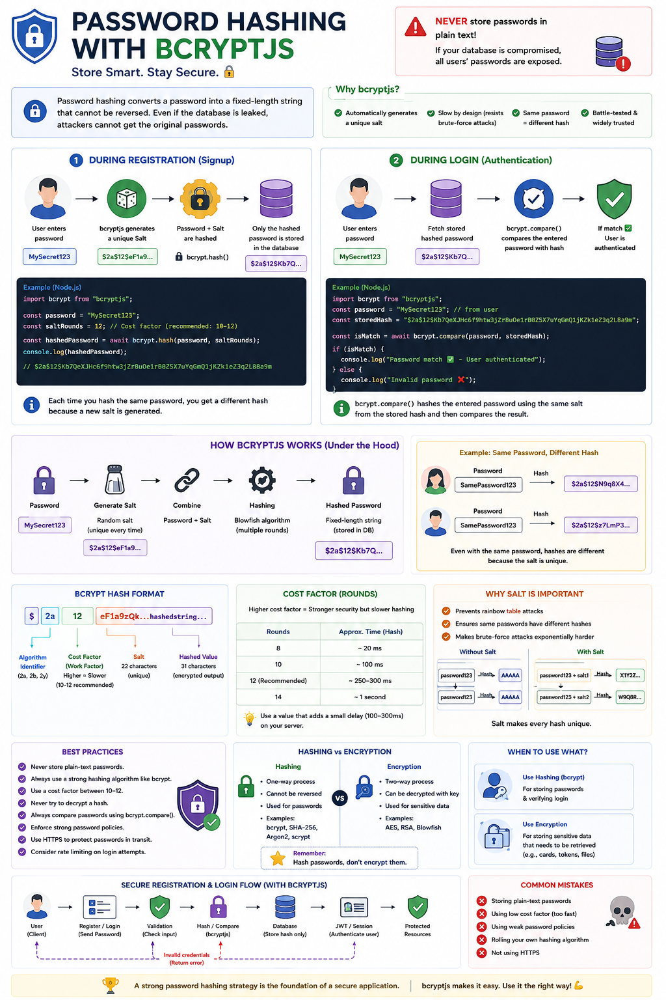

One of the biggest security mistakes you can make as a backend developer is storing passwords like this:

```text
password = "MySecret123"
```

If your database is ever compromised, every user's password is instantly exposed. 💥

That's why we **never store plain-text passwords**.

We store a **hashed version** instead.

🔐 **Password Hashing** transforms a password into a fixed-length string that cannot be reversed back into the original password.

With **bcryptjs**, the process looks like this:

### During Registration

1️⃣ User enters a password.

2️⃣ `bcryptjs` generates a unique **Salt**.

3️⃣ The password + salt are hashed together.

4️⃣ Only the hashed password is stored in the database.

```js
import bcrypt from "bcryptjs";

const hashedPassword = await bcrypt.hash(password, 12);
```

---

### During Login

1️⃣ User enters their password.

2️⃣ Fetch the stored hash from the database.

3️⃣ Compare the entered password with the stored hash.

```js
const isMatch = await bcrypt.compare(
  password,
  hashedPassword
);
```

If they match ✅
User is authenticated.

Notice something important:

The original password is **never decrypted**.

`bcrypt.compare()` hashes the entered password again using the same salt and checks if the result matches the stored hash.

---

### Why bcrypt?

✅ Automatically generates a unique salt for every password.

✅ Even if two users have the same password, their hashes will be completely different.

✅ Intentionally slow, making brute-force attacks much harder.

✅ Battle-tested and trusted by millions of applications.

---

### Best Practices

✅ Never store plain-text passwords.

✅ Never create your own hashing algorithm.

✅ Use an appropriate cost factor (typically **10–12**).

✅ Always compare passwords with `bcrypt.compare()`.

✅ Force strong passwords before hashing.

✅ Use HTTPS so passwords are encrypted in transit.

---

### Hashing ≠ Encryption

A common interview question:

🔹 **Hashing**
One-way process.
Used for passwords.
Cannot be reversed.

🔹 **Encryption**
Two-way process.
Can be decrypted with a key.
Used for sensitive data like payment information or private documents.

Remember:

> You should **hash passwords**, not encrypt them.

A secure authentication system starts with protecting user credentials properly.

How do you handle password security in your applications?

🔹 bcryptjs
🔹 bcrypt
🔹 Argon2
🔹 scrypt

👇 Share your preferred approach!

#NodeJS #JavaScript #Backend #Authentication #PasswordSecurity #bcrypt #CyberSecurity #ExpressJS #SoftwareEngineering #WebDevelopment
