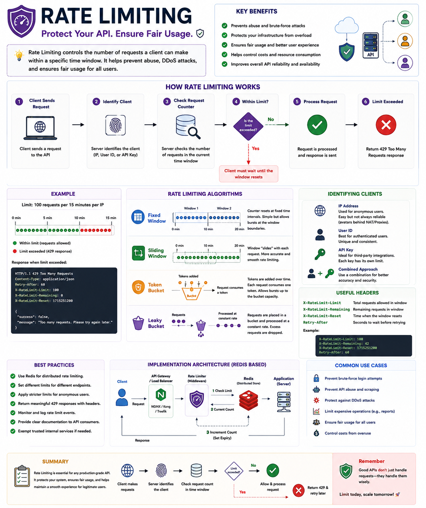

Your API works perfectly...

Until one user sends **10,000 requests in a minute.** 💥

Now your server is overloaded, legitimate users experience slow responses, and your infrastructure costs start climbing.

That's where **Rate Limiting** comes in. 🛡️

Rate Limiting controls **how many requests a client can make within a specific time window**, protecting your API from abuse while keeping it available for everyone.

### Example

Let's say your API allows:

```text
100 requests / 15 minutes
```

If a client exceeds that limit:

```http
HTTP/1.1 429 Too Many Requests
```

```json
{
  "success": false,
  "message": "Too many requests. Please try again later."
}
```

The server temporarily blocks additional requests until the window resets.

---

### How Rate Limiting Works

1️⃣ Client sends a request.

2️⃣ Server identifies the client (IP Address, User ID, or API Key).

3️⃣ Request counter is checked.

4️⃣ If the limit hasn't been reached:
✅ Request is processed.

5️⃣ If the limit is exceeded:
❌ Return **429 Too Many Requests**.

---

### Common Rate Limiting Algorithms

🔹 **Fixed Window**
Simple and fast, but can allow traffic spikes at window boundaries.

🔹 **Sliding Window**
Smooths request distribution and provides more accurate limiting.

🔹 **Token Bucket**
Tokens are added over time. Each request consumes one token.
Great for allowing occasional bursts.

🔹 **Leaky Bucket**
Processes requests at a constant rate, preventing sudden spikes.

---

### Why Every API Needs Rate Limiting

✅ Prevents brute-force login attacks

✅ Reduces API abuse and spam

✅ Protects against DDoS attempts

✅ Prevents resource exhaustion

✅ Ensures fair usage for all users

✅ Helps control infrastructure costs

---

### Best Practices

✅ Use Redis for distributed rate limiting.

✅ Apply different limits for authenticated and anonymous users.

✅ Return helpful headers like:

* `X-RateLimit-Limit`
* `X-RateLimit-Remaining`
* `Retry-After`

✅ Exempt trusted internal services when appropriate.

✅ Monitor rate-limit events to detect suspicious behavior.

Rate Limiting isn't about blocking users—it's about protecting your application and ensuring a reliable experience for everyone.

What's your preferred rate-limiting strategy?

🔹 Fixed Window
🔹 Sliding Window
🔹 Token Bucket
🔹 Leaky Bucket

👇 Share your thoughts!

#NodeJS #JavaScript #Backend #API #RateLimiting #ExpressJS #Redis #WebDevelopment #SoftwareEngineering #SystemDesign
