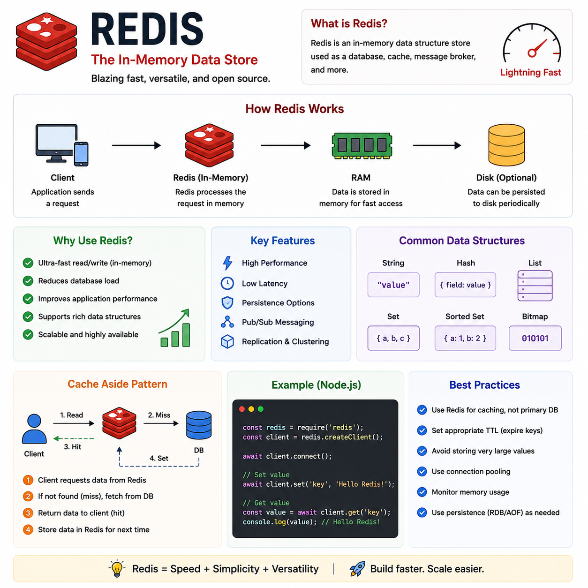

Your database is fast...

Until thousands of users start requesting the **same data** every second.

Now every request hits the database, response times increase, and your servers work harder than they need to.

That's where **Redis** comes in. 🚀

Redis is an **in-memory data store** commonly used as a **cache** to make applications significantly faster.

Instead of fetching data from the database every time, your application first checks Redis.

---

## How Redis Works

1️⃣ Client requests data.

2️⃣ Application checks Redis.

3️⃣ **Cache Hit** ✅
If the data exists, Redis returns it instantly.

4️⃣ **Cache Miss** ❌
If the data doesn't exist:

* Fetch it from the database.
* Store it in Redis.
* Return it to the client.

This is known as the **Cache-Aside Pattern**.

---

## Why Use Redis?

⚡ Ultra-fast (stores data in RAM)

📉 Reduces database load

🚀 Improves response times

📦 Supports rich data structures (Strings, Hashes, Lists, Sets, Sorted Sets)

⏳ Built-in TTL (Time To Live) for automatic expiration

---

## Common Use Cases

✅ API Response Caching

✅ User Sessions

✅ Rate Limiting

✅ Leaderboards

✅ Shopping Carts

✅ Real-time Analytics

✅ Pub/Sub Messaging

---

## Best Practices

✅ Cache frequently accessed data.

✅ Set a TTL to prevent stale data.

✅ Don't cache everything—only data that's expensive to compute or fetch.

✅ Invalidate or update the cache when the underlying data changes.

✅ Monitor memory usage and eviction policies.

---

## Redis vs Database

🟥 **Redis**

* In-memory (RAM)
* Extremely fast
* Best for caching and temporary data

🗄️ **Database**

* Persistent storage
* Source of truth
* Best for long-term data

Think of Redis as a **high-speed shortcut** to your database—not a replacement for it.

A simple caching layer can reduce database traffic dramatically and make your application feel much faster.

Are you using Redis in your projects?

👇 What's your favorite Redis use case?

#Redis #Caching #NodeJS #Backend #JavaScript #WebDevelopment #SystemDesign #Performance #SoftwareEngineering #Database
