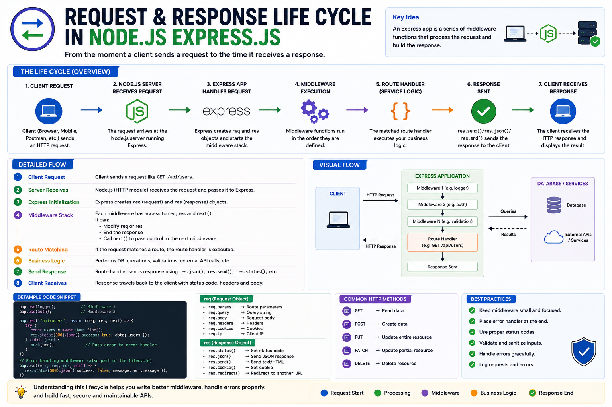

Every time you open a website or click a button...

A complete journey begins behind the scenes.

From the moment a client sends a request until it receives a response, your backend performs multiple steps before returning data.

This journey is called the **Request & Response Lifecycle**.

Understanding it is one of the best ways to become a better backend developer. 🚀

---

## What is the Request & Response Lifecycle?

It's the sequence of steps that every HTTP request follows inside your Node.js/Express application.

Every request goes through the same pipeline before reaching your business logic and returning a response.

---

## The Complete Flow

```text id="3gk4wz"
Client
   │
   ▼
HTTP Request
   │
   ▼
Node.js Server
   │
   ▼
Express Application
   │
   ▼
Middleware Stack
   │
   ▼
Route Handler
   │
   ▼
Business Logic
   │
   ▼
Database / External APIs
   │
   ▼
HTTP Response
   │
   ▼
Client
```

Let's understand each step.

---

## 1️⃣ Client Sends a Request

The lifecycle begins when a client sends an HTTP request.

Examples:

* Browser
* Mobile App
* Postman
* Another Backend Service

```http id="b5n7xp"
GET /api/users
```

---

## 2️⃣ Node.js Receives the Request

The Node.js runtime accepts the incoming TCP/HTTP connection.

It then passes the request to your Express application.

At this point, Express creates two important objects:

* `req` (Request)
* `res` (Response)

These objects travel through the rest of the lifecycle.

---

## 3️⃣ Middleware Executes

Before reaching your route, the request passes through middleware.

Examples:

✅ Logger

✅ CORS

✅ JSON Parser

✅ Authentication

✅ Validation

Each middleware can:

* Read the request
* Modify the request
* Send a response
* Call `next()` to continue

If a middleware sends a response, the lifecycle ends there.

---

## 4️⃣ Route Matching

Express checks whether the request matches one of your routes.

Example:

```http id="q2m9kt"
GET /api/users
```

matches:

```js id="c8v4ly"
app.get("/api/users", ...)
```

If no route matches:

Express returns:

```http id="e7x3rh"
404 Not Found
```

---

## 5️⃣ Business Logic Runs

This is where your application's real work happens.

For example:

* Validate business rules
* Query the database
* Upload a file
* Send an email
* Call another API
* Cache data in Redis

Your controller or service layer performs these operations.

---

## 6️⃣ Database or External Services

Many requests need data from elsewhere.

Examples:

🗄️ PostgreSQL

🍃 MongoDB

⚡ Redis

☁️ AWS S3

📧 Email Service

🌍 Third-party APIs

The backend gathers everything needed to build the response.

---

## 7️⃣ Response is Sent

Once processing is complete, Express sends the response.

Example:

```js id="r1z6fw"
res.status(200).json({
  success: true,
  data: users,
});
```

The response includes:

* Status Code
* Headers
* Response Body

After sending the response, the request lifecycle ends.

---

## What Happens If Something Goes Wrong?

Suppose the database throws an error.

Instead of crashing the application:

```text id="j6t2qm"
Error
   │
   ▼
next(error)
   │
   ▼
Global Error Handler
   │
   ▼
Consistent Error Response
```

This keeps your API reliable and makes debugging much easier.

---

## Why Understanding the Lifecycle Matters

Once you understand the flow, you'll know:

✅ Where authentication should happen.

✅ Where validation belongs.

✅ When middleware executes.

✅ When database queries run.

✅ Where errors should be handled.

✅ How responses are generated.

Everything in Express is built around this lifecycle.

---

## Best Practices

✅ Keep middleware focused on one responsibility.

✅ Validate requests before reaching business logic.

✅ Handle errors with a global error handler.

✅ Keep controllers thin—move business logic to services.

✅ Return consistent response formats.

---

## A Simple Way to Remember

📤 **Client sends a request.**

🚦 **Middleware prepares it.**

🛠️ **Route handles it.**

🗄️ **Business logic processes it.**

📦 **Server sends a response.**

That's the complete journey every API request takes.

Once you understand this lifecycle, concepts like middleware, authentication, validation, and error handling all start to make perfect sense.

What's your favorite part of the Express request lifecycle to work with?

🔹 Middleware

🔹 Route Handlers

🔹 Services

🔹 Database Layer

👇 Let me know!

#NodeJS #ExpressJS #JavaScript #Backend #API #WebDevelopment #SoftwareEngineering #Programming #SystemDesign #HTTP


