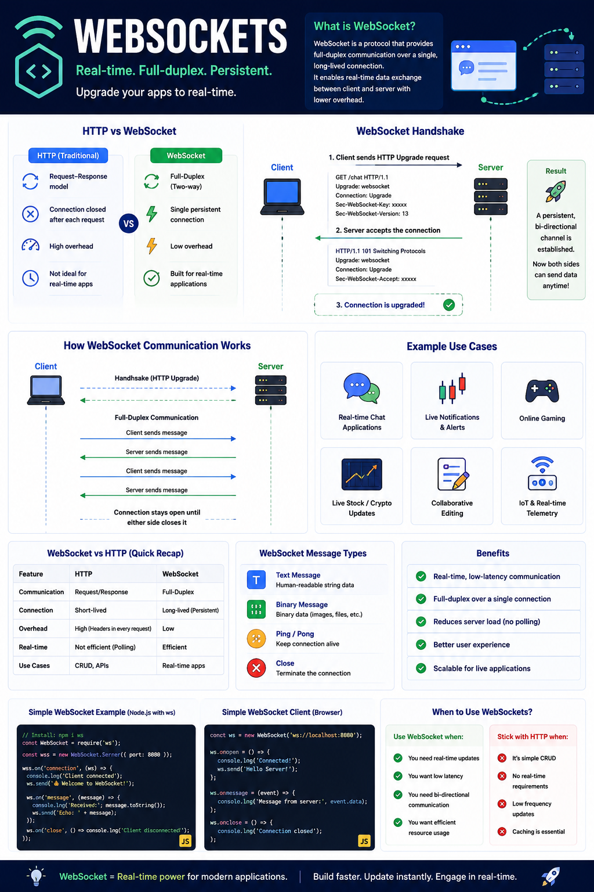

Most web applications use **HTTP**.

But what if you need **real-time communication**?

Think about:

💬 Chat applications

📈 Live stock prices

🎮 Multiplayer games

📍 Live location tracking

🔔 Instant notifications

Making an HTTP request every second would be inefficient.

That's where **WebSockets** come in.

---

## What is WebSocket?

A **WebSocket** is a protocol that creates a **persistent, two-way (full-duplex)** connection between the client and the server.

Unlike HTTP, the connection stays open, allowing both the client and server to send messages at any time.

---

## How WebSocket Works

1️⃣ Client sends an HTTP request asking to upgrade the connection.

```http id="1zh9ub"
GET /chat HTTP/1.1
Upgrade: websocket
Connection: Upgrade
```

2️⃣ Server accepts the request.

```http id="s1emq8"
HTTP/1.1 101 Switching Protocols
```

3️⃣ The connection is upgraded.

4️⃣ Both client and server can now exchange messages instantly without creating new HTTP requests.

---

## HTTP vs WebSocket

🌐 **HTTP**

* Request → Response
* New connection for each request
* Client always initiates communication
* Great for REST APIs and CRUD operations

⚡ **WebSocket**

* Persistent connection
* Full-duplex communication
* Client and server can send messages anytime
* Designed for real-time applications

---

## Common Use Cases

✅ Real-time chat

✅ Live notifications

✅ Multiplayer games

✅ Stock & crypto price updates

✅ Collaborative editing (Google Docs)

✅ Live dashboards

✅ IoT device communication

---

## Benefits

🚀 Low latency

🔄 Full-duplex communication

📉 Less network overhead

⚡ Instant updates

📈 Better scalability for real-time systems

---

## Best Practices

✅ Authenticate users during the connection handshake.

✅ Validate every incoming message.

✅ Use heartbeat (Ping/Pong) to detect disconnected clients.

✅ Reconnect gracefully if the connection drops.

✅ Close inactive connections to free resources.

---

## When NOT to Use WebSockets

If your application only performs:

* Login
* Registration
* CRUD operations
* Occasional API requests

Regular HTTP is usually the better choice.

Use WebSockets **only when real-time communication adds value**.

---

A simple way to remember it:

🌐 **HTTP** → "Ask, then receive."

⚡ **WebSocket** → "Stay connected and communicate anytime."

Choosing the right protocol can make your application faster, more responsive, and more scalable.

Have you built anything with WebSockets?

👇 What did you use them for?

#WebSocket #NodeJS #JavaScript #Backend #WebDevelopment #SystemDesign #RealTime #SoftwareEngineering #Programming #SocketIO



