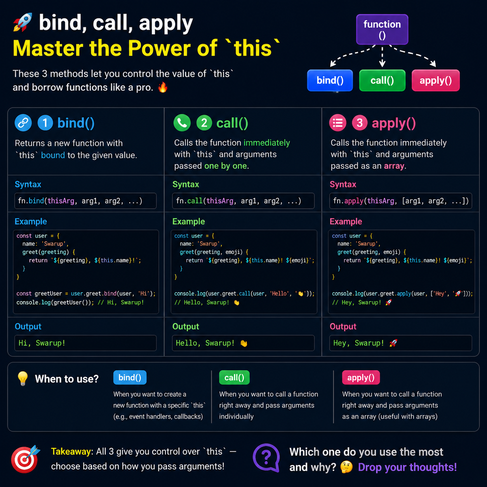

Most JavaScript developers know `bind()`, `call()`, and `apply()`, but many struggle to know **when to use each one**.

Here's the simplest way to remember them:

✅ **bind()**
Creates a **new function** with a fixed `this` value.
Perfect for event handlers, callbacks, and passing methods around.

```js
const boundFn = greet.bind(user);
boundFn();
```

✅ **call()**
Invokes the function **immediately**.
Arguments are passed one by one.

```js
greet.call(user, "Hello");
```

✅ **apply()**
Also invokes the function **immediately**.
Arguments are passed as an array.

```js
greet.apply(user, ["Hello"]);
```

### The easy trick to remember:

* 🔹 **bind** → Returns a new function (call later)
* 🔹 **call** → Calls now (individual arguments)
* 🔹 **apply** → Calls now (array of arguments)

Once you understand these three methods, concepts like event handlers, callbacks, method borrowing, and controlling `this` become much easier.

💡 **Interview Tip:**
A common question is:

> "What's the difference between `call`, `apply`, and `bind`?"

If you can explain **when each should be used**, you're already ahead of many candidates.

Which one do you use the most in real projects—`bind()`, `call()`, or `apply()`? 👇

#JavaScript #WebDevelopment #Frontend #ReactJS #NodeJS #100DaysOfCode #Coding #Programming #SoftwareEngineering
