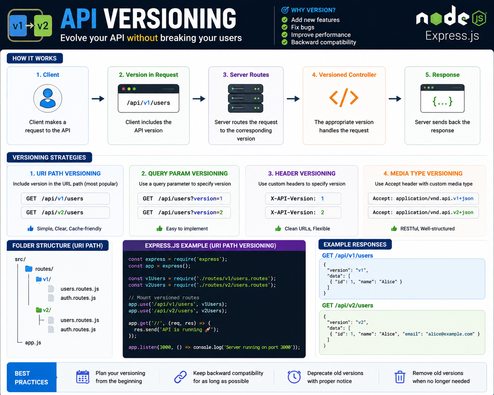

Your API will evolve—but your users shouldn't have to suffer because of it. 🚀

That's why **API Versioning** matters.

Instead of breaking existing clients, introduce a new version while keeping the old one working.

A common approach:

```text id="n2d7hf"
GET /api/v1/users
GET /api/v2/users
```

Why version your API?

✨ Add new features safely
🐞 Fix bugs without breaking existing apps
🔄 Maintain backward compatibility
📈 Let clients upgrade at their own pace

Popular versioning strategies:

📍 URI Path → `/api/v1/users` *(most common)*
📨 Headers → `X-API-Version: 1`
🔍 Query Params → `?version=1`
📄 Media Types → `Accept: application/vnd.api.v1+json`

💡 Plan for versioning early. It's much easier to maintain multiple API versions than to recover from a breaking change in production.

Which API versioning strategy do you prefer for production systems? 👇

#ExpressJS #NodeJS #Backend #JavaScript #API #RESTAPI #WebDevelopment #Programming #Coding


