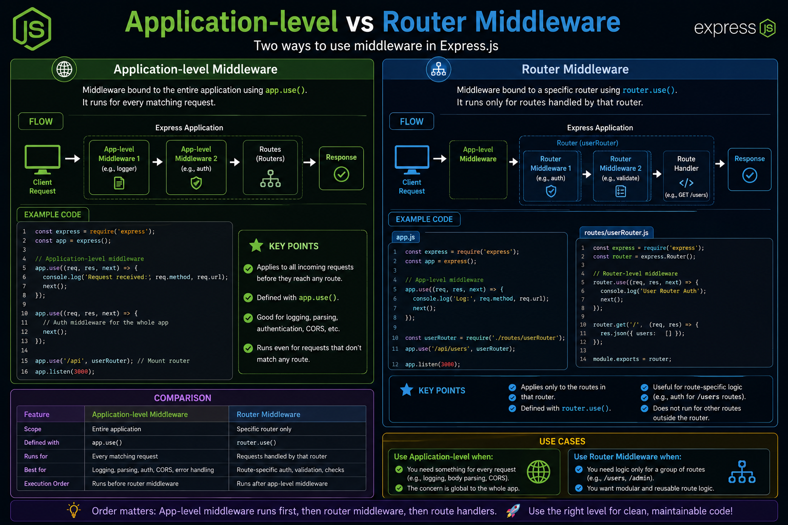

Not all Express middleware works at the same level. Knowing **where** to apply it can keep your code clean and scalable. 🚀

**🌍 Application-level Middleware**
✅ Runs across the entire app
✅ Registered with `app.use()`
✅ Perfect for logging, CORS, body parsing, and global authentication

**🛣️ Router Middleware**
✅ Runs only for a specific router
✅ Registered with `router.use()`
✅ Ideal for route-specific authentication, validation, and permissions

Think of it like this:

🌍 **Application-level** → Every visitor entering the building.
🚪 **Router-level** → Security for a specific room.

💡 Rule of thumb: Put shared logic in application middleware, and feature-specific logic inside routers.

Which approach do you use more in your Express projects? 👇

#ExpressJS #NodeJS #Backend #JavaScript #WebDevelopment #API #Programming #Coding

