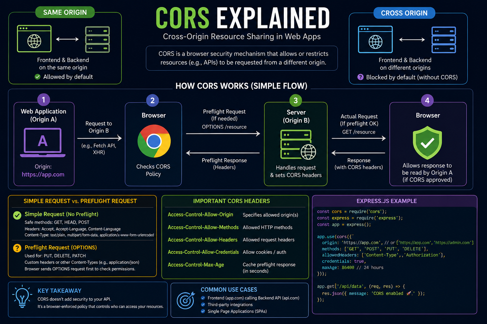

Ever wondered why your frontend gets a **"CORS error"** even though your API is running? 🤔

It's not your API—it's your browser protecting users.

**CORS (Cross-Origin Resource Sharing)** is a browser security mechanism that controls which websites can access resources from another origin.

Example:
🌐 Frontend → `https://app.com`
🔗 API → `https://api.com`

Different origins? The browser checks if the API explicitly allows the request.

Without the right CORS headers:
❌ Browser blocks the response

With CORS configured:
✅ Browser allows the request

In Express.js, enabling CORS is as simple as using the `cors` middleware and allowing only trusted origins.

💡 CORS doesn't secure your API—it tells **browsers** which origins are allowed to access it. Your API should still enforce authentication and authorization.

Have you ever spent hours debugging a CORS error? 😅👇

#ExpressJS #NodeJS #Backend #JavaScript #CORS #WebDevelopment #API #Programming #Coding

