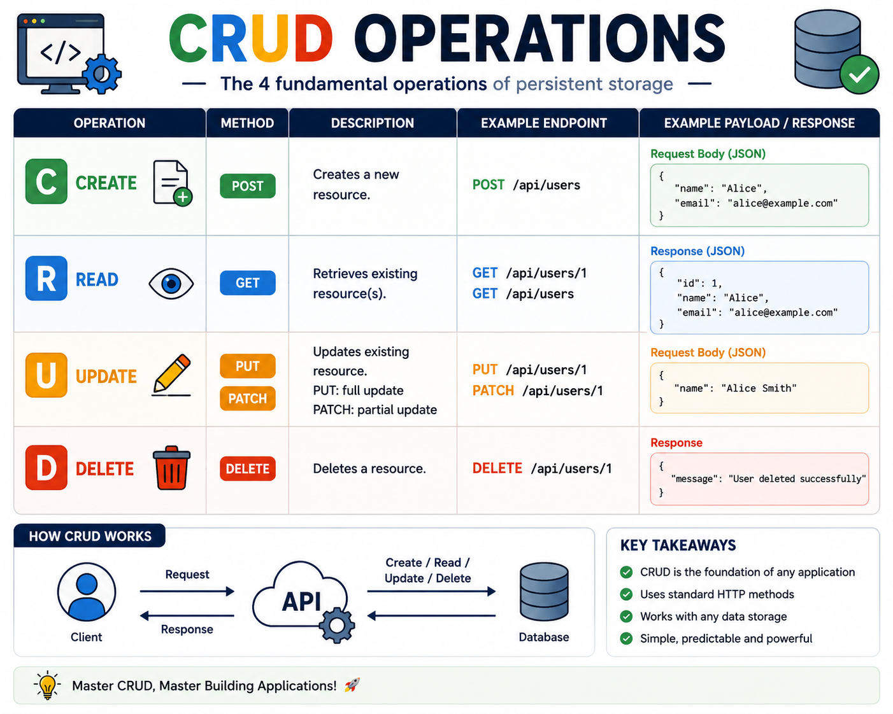

Almost every backend API is built around **CRUD**.

Master these four operations, and you've mastered the foundation of backend development. 🚀

**CRUD =**

🟢 **Create** → `POST /users`
🔵 **Read** → `GET /users` or `GET /users/:id`
🟠 **Update** → `PUT` / `PATCH /users/:id`
🔴 **Delete** → `DELETE /users/:id`

Think of a user management system:

➕ Register a new user
👀 View user details
✏️ Update profile information
🗑️ Delete an account

💡 Bonus tip:

* `PUT` = Replace the entire resource
* `PATCH` = Update only specific fields

CRUD may seem simple, but it's the backbone of REST APIs, databases, and almost every web application you use daily.

Before building complex systems, make sure your CRUD operations are clean, consistent, and predictable. 💪

Which CRUD operation do you find the trickiest to design correctly—**Create, Read, Update, or Delete?** 👇

#NodeJS #ExpressJS #RESTAPI #Backend #JavaScript #WebDevelopment #Programming #Coding #CRUD

