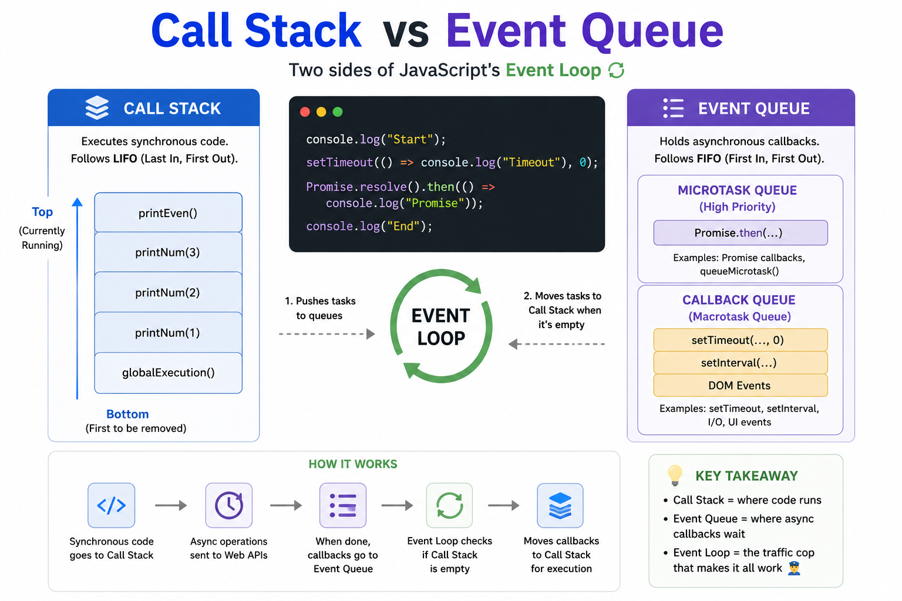

⚡ **Call Stack and Event Queue work together to make JavaScript asynchronous.**

Here's the difference:

📚 **Call Stack**
• Executes synchronous code
• Follows **LIFO** (Last In, First Out)
• Only one function runs at a time

📥 **Event Queue**
• Stores completed async callbacks
• Follows **FIFO** (First In, First Out)
• Waits until the Call Stack is empty

🌀 **Event Loop** continuously checks:

1. Is the Call Stack empty?
2. If yes, move the next callback from the Event Queue to the Call Stack.

Think of it like this:
🧑‍💻 Call Stack = Chef cooking
📋 Event Queue = Orders waiting
🚦 Event Loop = Manager sending the next order when the chef is free.

Understanding these three concepts is the key to mastering asynchronous JavaScript.

#JavaScript #WebDevelopment #Frontend #NodeJS #AsyncProgramming #Coding

