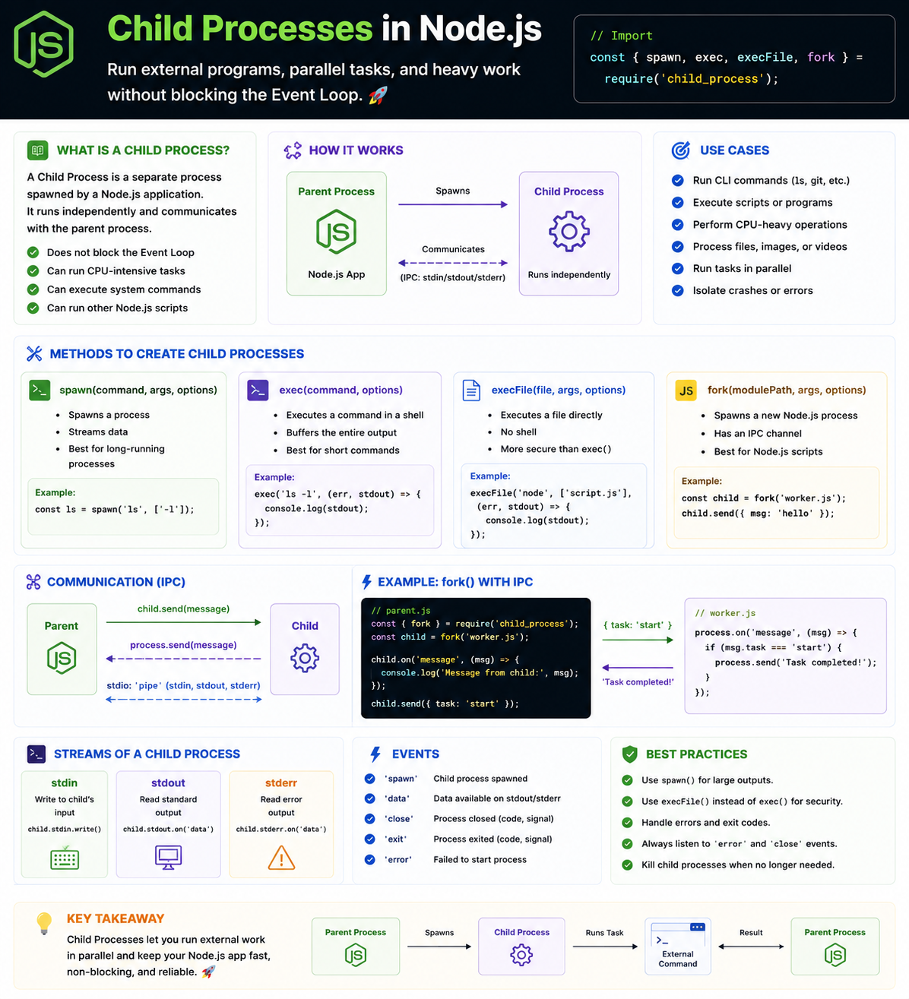

🚀 **Need to run heavy tasks or external commands without blocking your Node.js app?**

That's exactly what **Child Processes** are for.

A Child Process runs as a **separate OS process**, keeping the main Event Loop responsive.

Choose the right method:

🔹 `spawn()` → Stream output from long-running processes
🔹 `exec()` → Run a shell command and get the output at once
🔹 `execFile()` → Execute a file directly (no shell)
🔹 `fork()` → Create another Node.js process with built-in IPC

Example:

```js id="v8q1nm"
const { spawn } = require("child_process");

const ls = spawn("ls", ["-la"]);

ls.stdout.on("data", data => {
  console.log(data.toString());
});
```

💡 Rule of thumb:

* 🧵 **Worker Threads** → CPU-heavy JavaScript
* 👶 **Child Processes** → External programs or isolated processes
* 🖥️ **Cluster** → Scale HTTP servers across CPU cores

Knowing when to use each can make your Node.js apps far more scalable. ⚡

#NodeJS #JavaScript #Backend #WebDevelopment #Performance #Coding


