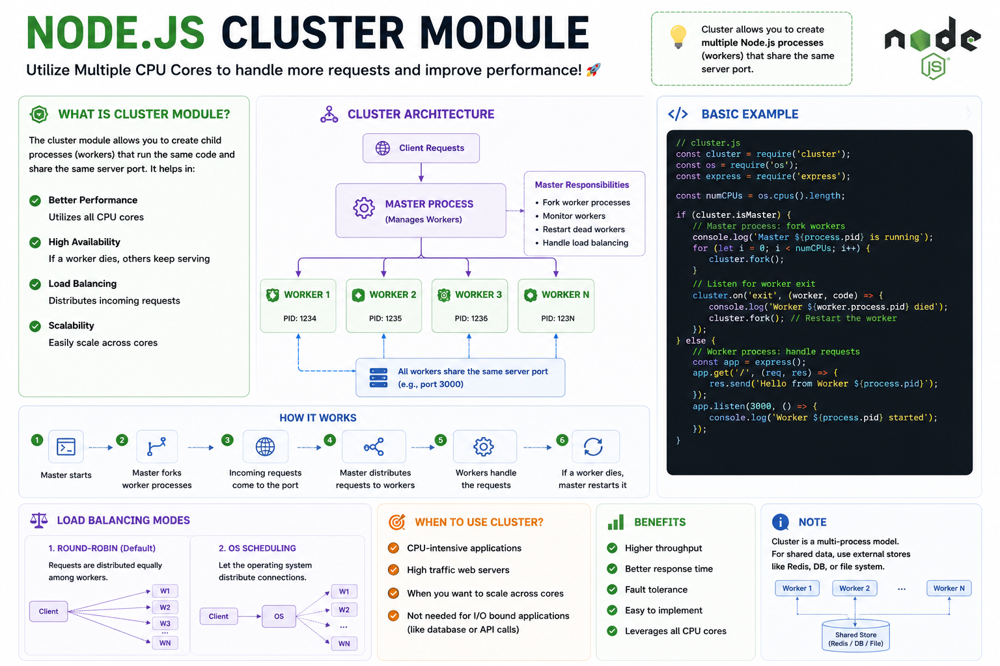

🚀 **One Node.js process uses only one CPU core.**

If your server gets thousands of requests, you're leaving performance on the table.

That's where the **Cluster Module** comes in. 👇

⚡ It creates multiple worker processes that:
• Share the same server port
• Run on multiple CPU cores
• Handle requests in parallel
• Improve throughput and reliability

How it works:

👑 Master Process
⬇️ Forks multiple Workers
⚖️ Distributes incoming requests
🔄 Restarts workers automatically if one crashes

💡 **Cluster is ideal for scaling web servers**, while **Worker Threads** are better for CPU-intensive tasks within a single process.

Use the right tool for the job:
🧵 Worker Threads → CPU-bound tasks
🖥️ Cluster → High-traffic HTTP servers

#NodeJS #JavaScript #Backend #WebDevelopment #Performance #Scalability #Coding

