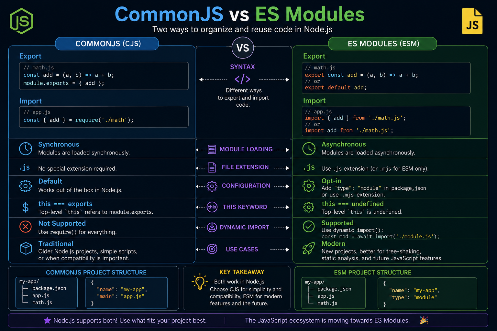

Still confused about **CommonJS** vs **ES Modules** in Node.js? 🤔

Here's the quick breakdown:

📦 **CommonJS (CJS)**
✅ `require()` & `module.exports`
✅ Synchronous loading
✅ Default in older Node.js projects
✅ Great for legacy codebases

⚡ **ES Modules (ESM)**
✅ `import` & `export`
✅ Static imports + better optimization
✅ Supports top-level `await`
✅ The modern JavaScript standard

**CommonJS**

```js
const fs = require('fs');
module.exports = { readFile };
```

**ES Modules**

```js
import fs from 'node:fs';
export { readFile };
```

💡 If you're starting a new Node.js project today, **ES Modules** are generally the better choice. Use CommonJS when maintaining existing projects or libraries that depend on it.

Which module system are you using in your current project—**CommonJS** or **ES Modules**? 👇

#NodeJS #JavaScript #Backend #WebDevelopment #Programming #Coding #ESModules #CommonJS


