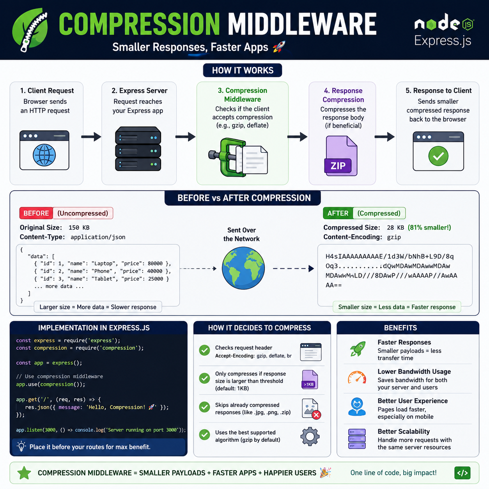

Want your Express.js app to feel faster without changing your business logic? 🚀

Use **Compression Middleware**.

It compresses HTTP responses before they're sent to the client, reducing payload size and improving load times.

```js
const compression = require('compression');

app.use(compression());
```

Why it matters:

📦 Smaller response sizes
⚡ Faster page and API responses
🌐 Lower bandwidth usage
📈 Better performance for users on slow networks

How it works:
➡️ Client requests data
➡️ Express compresses the response (Gzip/Brotli when supported)
➡️ Browser automatically decompresses it

💡 Compression is great for JSON, HTML, CSS, and JavaScript—but not for files that are already compressed like images, videos, or ZIP files.

A single middleware can make your API noticeably faster. 🎯

Do you enable compression by default in your Express apps? 👇

#ExpressJS #NodeJS #Backend #JavaScript #Performance #WebDevelopment #API #Programming #Coding

