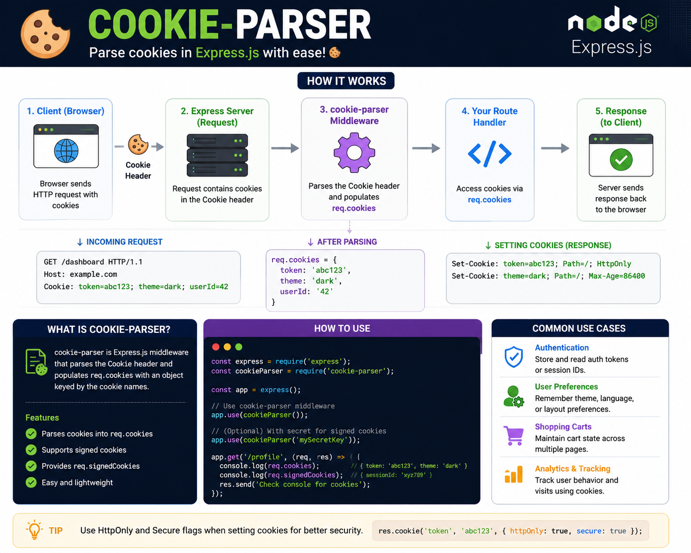

Cookies are just strings in HTTP headers... until **cookie-parser** makes them easy to use. 🍪

Instead of manually parsing cookies, Express can do it for you.

```js id="u7mq2p"
const cookieParser = require('cookie-parser');

app.use(cookieParser());
```

Now every request gets:

```js id="q8n4rx"
req.cookies
```

Common use cases:

🔐 Session authentication
🎟️ JWT stored in HttpOnly cookies
⚙️ User preferences (theme, language)
🛒 Shopping cart persistence

You can also verify **signed cookies** to detect if they've been tampered with.

💡 `cookie-parser` only reads and parses cookies—it doesn't make them secure. Always use `HttpOnly`, `Secure`, and `SameSite` attributes when setting sensitive cookies.

Small middleware. Big convenience. 🚀

Do you prefer storing JWTs in **HttpOnly cookies** or **Authorization headers**? 👇

#ExpressJS #NodeJS #Backend #JavaScript #Authentication #Cookies #WebDevelopment #Programming #Coding

