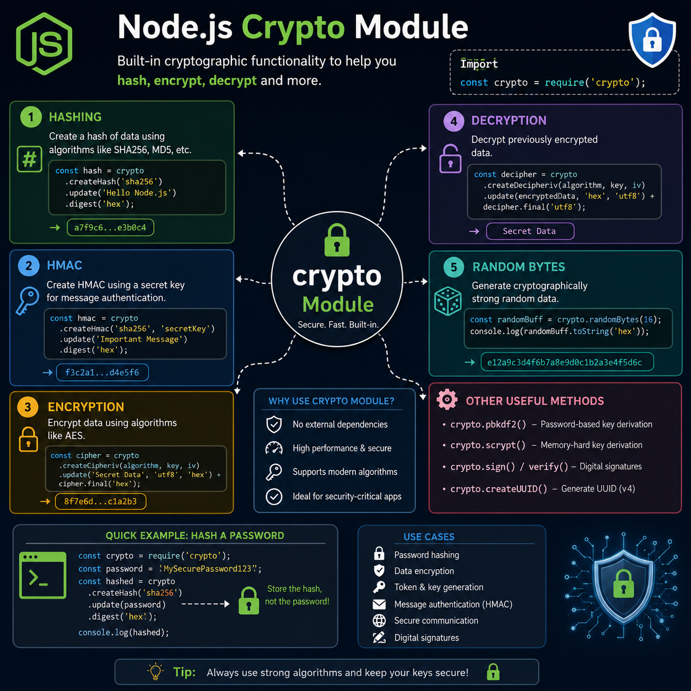

Think you need a third-party library for cryptography? 🔐

Node.js ships with a powerful built-in `crypto` module that helps you build secure applications out of the box.

Here are a few essentials:

🔒 `createHash()` → Hash passwords & data (SHA-256, SHA-512, etc.)
🛡️ `createHmac()` → Verify data integrity with secret keys
🔑 `randomBytes()` → Generate cryptographically secure random values
📦 `scrypt()` / `pbkdf2()` → Secure password key derivation
✍️ `sign()` & `verify()` → Create and validate digital signatures
🆔 `randomUUID()` → Generate RFC-compliant UUIDs

Whether you're building authentication, APIs, or secure file transfers, the `crypto` module is one of the most valuable tools in Node.js.

💡 Security starts with using the right primitives—not reinventing them.

Which `crypto` API do you use most in your backend projects?

#NodeJS #JavaScript #Backend #CyberSecurity #WebDevelopment #Programming #Coding

