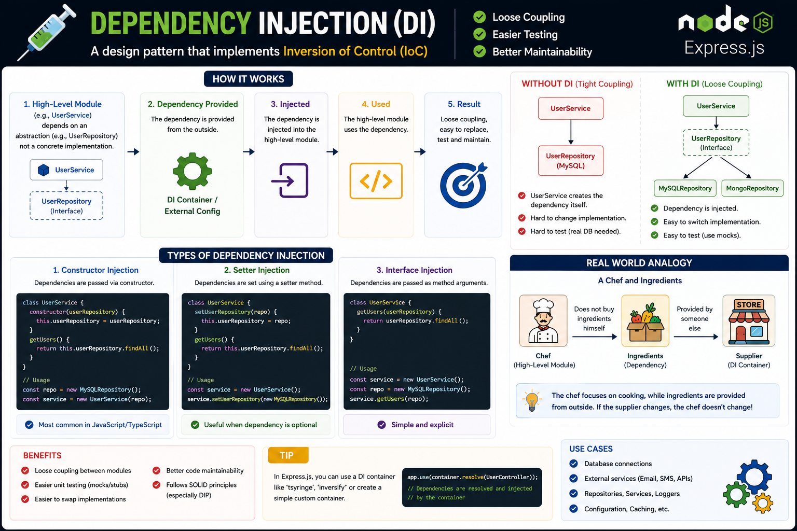

One of the biggest reasons code becomes hard to test? **Tight coupling.** 🔗❌

That's where **Dependency Injection (DI)** comes in.

Instead of creating dependencies inside a class, **inject them from the outside**.

❌ Tight coupling:

```js
const userService = new UserService(new MySQLRepository());
```

✅ Dependency Injection:

```js
const userService = new UserService(userRepository);
```

Why it matters:

🧩 Loose coupling between components
🧪 Easier unit testing with mocks
🔄 Swap implementations without changing business logic
📈 Cleaner, scalable architecture

Think of it this way:

👨‍🍳 A chef doesn't grow vegetables—they're supplied. The chef just focuses on cooking.

Your classes should do the same: focus on their responsibility while dependencies are provided externally.

💡 DI isn't just a pattern—it's the foundation of maintainable, testable applications, especially in large Node.js and Express.js projects.

Do you use a DI container (like TSyringe/Inversify) or prefer manual dependency injection? 👇

#NodeJS #ExpressJS #JavaScript #Backend #SoftwareArchitecture #CleanCode #DependencyInjection #Programming #Coding

