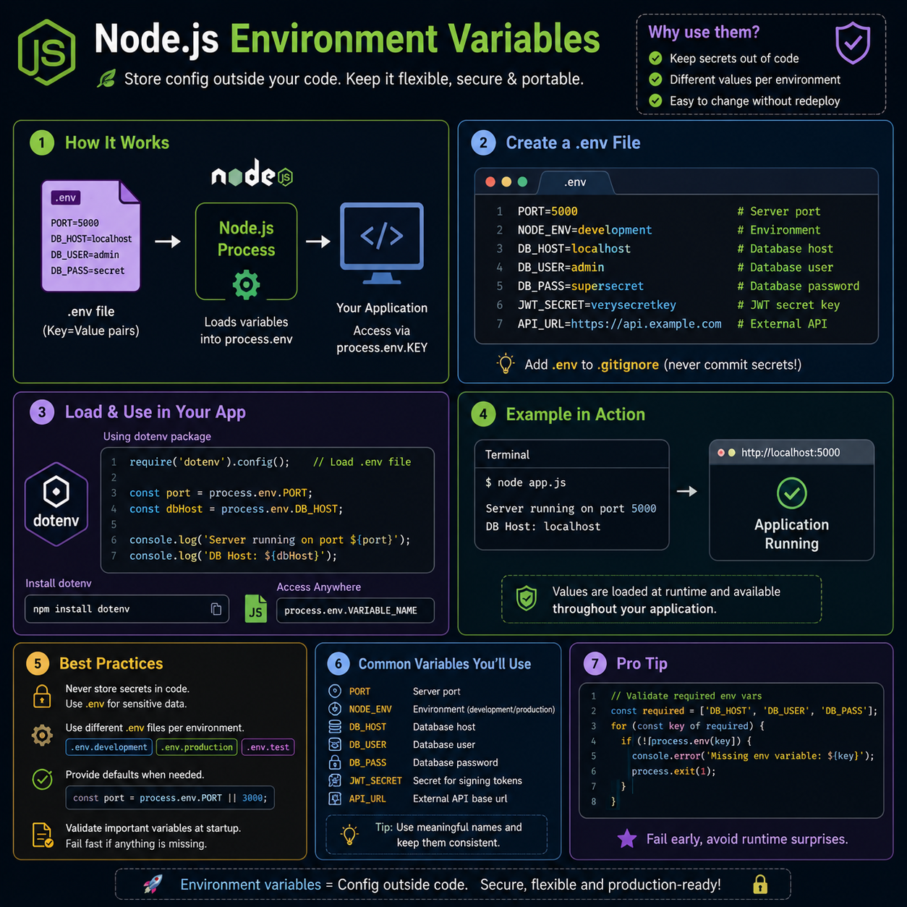

One of the easiest ways to make your Node.js app production-ready? 🌍

Use **Environment Variables** instead of hardcoding configuration.

Store things like:
🔐 API keys
🗄️ Database URLs
🎟️ JWT secrets
🌐 API endpoints
⚙️ Environment (`development`, `production`, `test`)

Access them anywhere with:

```js
process.env.PORT
process.env.JWT_SECRET
```

A few best practices:
✅ Never commit your `.env` file to Git
✅ Add `.env` to `.gitignore`
✅ Validate required variables when your app starts
✅ Use different `.env` files for different environments

Clean code, safer deployments, and easier configuration—all with one simple pattern. 🚀

What's the first environment variable you usually add to a new project?

#NodeJS #JavaScript #Backend #WebDevelopment #DevOps #Programming #Coding

