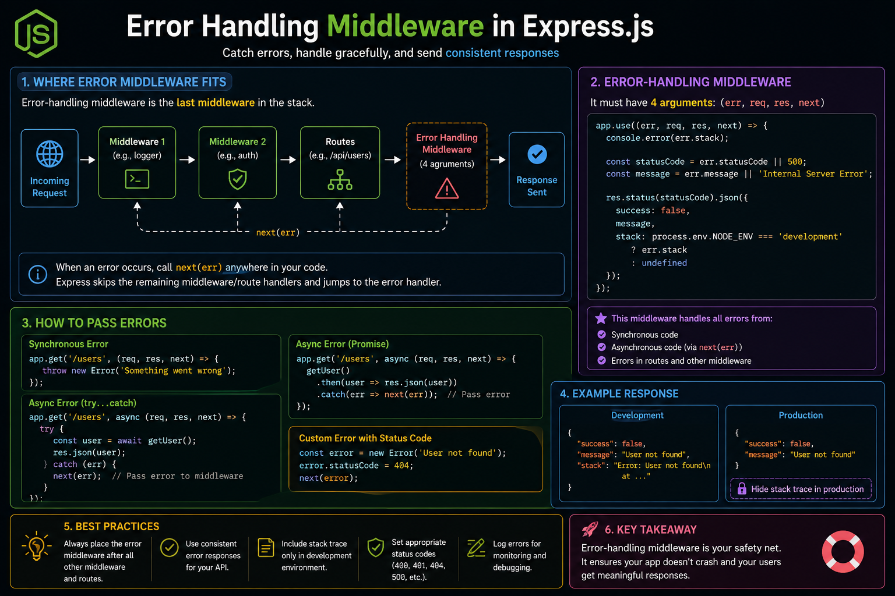

A great API doesn't just handle success—it handles errors gracefully. 🚨

In Express.js, **Error Handling Middleware** keeps your application clean, consistent, and easier to debug.

Remember these essentials:

⚠️ It must have **4 parameters**:

```js
(err, req, res, next)
```

🔄 Call `next(err)` to forward errors from routes or middleware.

📍 Register your error handler **after all routes and middleware**.

✅ Return consistent error responses
✅ Log errors for debugging
✅ Hide stack traces in production
✅ Send meaningful HTTP status codes

A centralized error handler means less duplicated code and a much better developer experience.

💡 Don't scatter `try...catch` everywhere—let Express handle errors in one place.

How do you structure error handling in your Express apps? 👇

#ExpressJS #NodeJS #Backend #JavaScript #API #WebDevelopment #Programming #Coding


