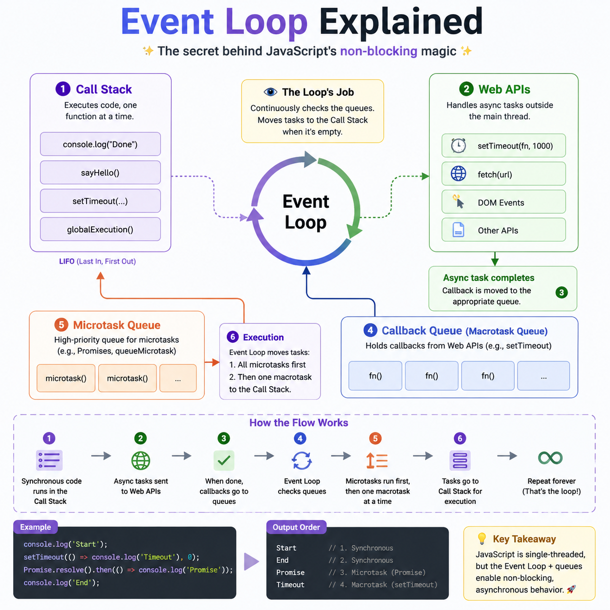

🚀 **JavaScript's Event Loop is what makes async code feel magical.**

Here's the execution flow:

🟣 Call Stack → Executes synchronous code
🟢 Web APIs → Handle async operations (`fetch`, `setTimeout`, events)
🟠 Microtask Queue → `Promise.then()`, `queueMicrotask()` (highest priority)
🔵 Callback Queue → `setTimeout`, `setInterval`, DOM events
♻️ Event Loop → Moves tasks to the Call Stack when it's empty.

Example:

```js
console.log("Start");

setTimeout(() => console.log("Timeout"), 0);

Promise.resolve().then(() => console.log("Promise"));

console.log("End");
```

Output:

```
Start
End
Promise
Timeout
```

💡 Remember: **Microtasks always run before the Callback Queue**, even if `setTimeout(..., 0)` is used.

Mastering the Event Loop will make debugging async JavaScript much easier.

#JavaScript #WebDevelopment #Frontend #NodeJS #100DaysOfCode #Coding


