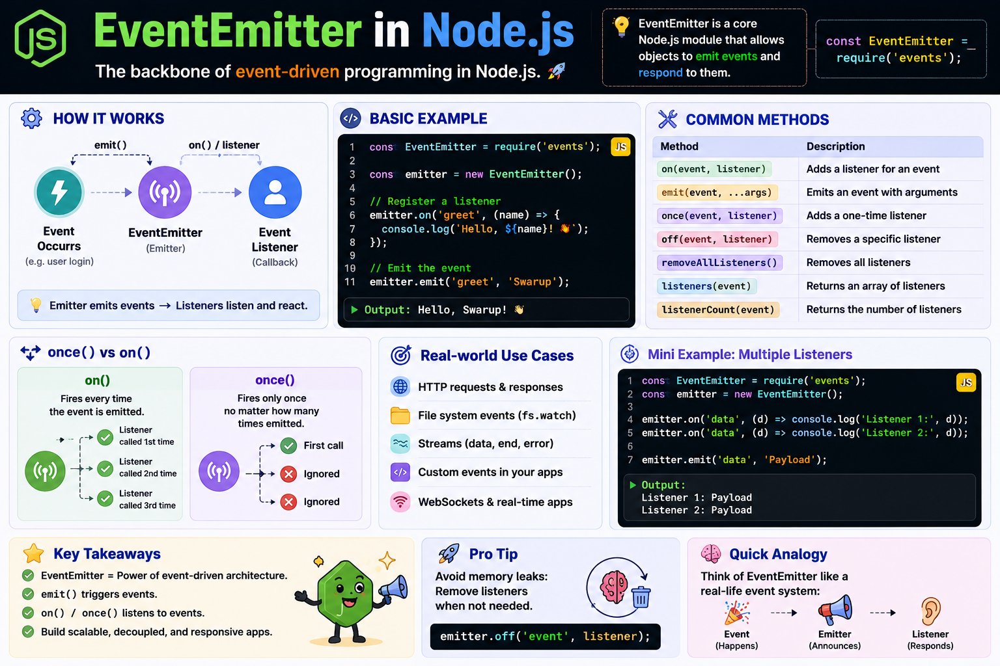

⚡ **EventEmitter is the backbone of Node.js's event-driven architecture.**

Instead of constantly checking if something happened, your app simply **listens** for events and reacts when they're emitted.

The flow is simple:

📢 `emit()` → Triggers an event
👂 `on()` → Listens every time the event occurs
🎯 `once()` → Listens only the first time
❌ `off()` → Removes a listener

Example:

```js id="x3k9pr"
const { EventEmitter } = require("events");

const emitter = new EventEmitter();

emitter.on("login", user => {
  console.log(`${user} logged in`);
});

emitter.emit("login", "Swarup");
```

💡 You'll find EventEmitter everywhere in Node.js:
• Streams (`data`, `end`, `error`)
• HTTP servers
• File system events
• WebSockets
• Custom application events

Think of it like this:
🎉 **Event happens → EventEmitter announces it → Listeners respond.**

That's what makes Node.js applications modular, scalable, and event-driven.

#NodeJS #JavaScript #Backend #WebDevelopment #EventDriven #Coding


