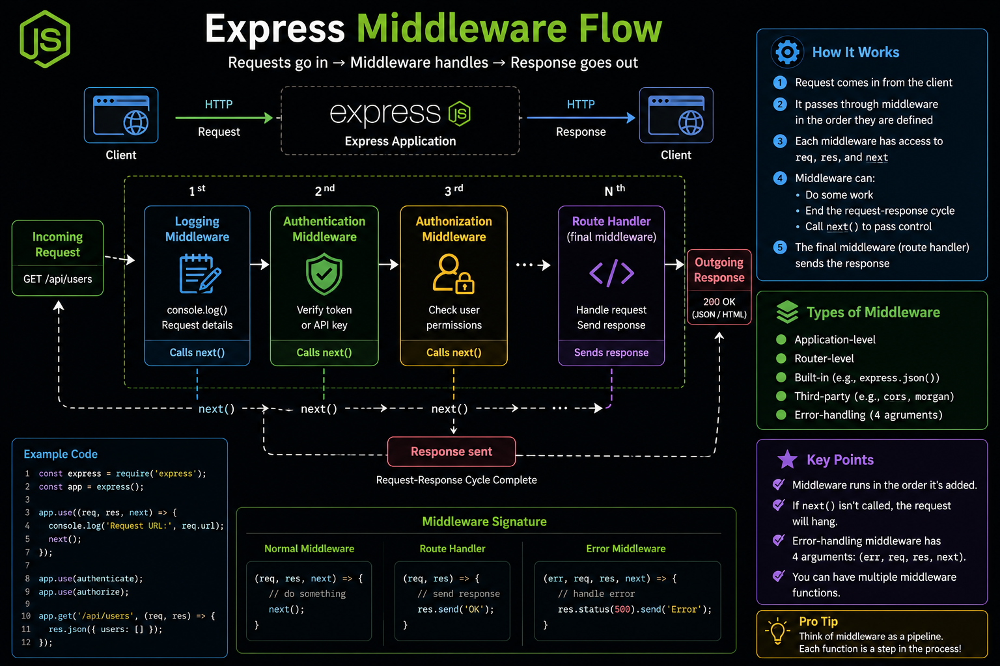

Every Express.js request follows a pipeline—and **middleware is what powers it.** ⚡

A typical request flows like this:

🌐 Client Request
⬇️
📝 Logging Middleware
⬇️
🔐 Authentication Middleware
⬇️
🛡️ Authorization Middleware
⬇️
🎯 Route Handler
⬇️
📤 Response

Each middleware can:
✅ Read or modify `req` and `res`
✅ Perform async operations
✅ End the request with a response
✅ Pass control using `next()`

💡 The order of middleware matters. If you forget to call `next()` (or send a response), the request can hang.

Once you understand the middleware flow, debugging Express apps becomes much easier.

What's your most-used Express middleware—`cors`, `express.json()`, authentication, or something else? 👇

#ExpressJS #NodeJS #Backend #JavaScript #WebDevelopment #API #Programming #Coding

