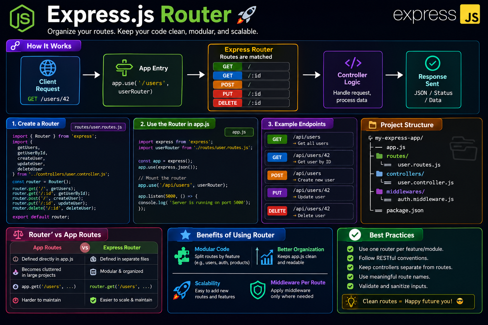

As your Express.js app grows, putting every route in `app.js` quickly becomes a mess. 🤯

That's where **Express Router** shines.

Instead of one giant file, split routes into feature-based modules:

```js id="zj4p7n"
const router = express.Router();

router.get('/', getUsers);
router.post('/', createUser);

module.exports = router;
```

Then mount it:

```js id="jlwm5s"
app.use('/users', userRouter);
```

Why use Express Router?

📂 Organizes routes by feature
♻️ Keeps code modular and reusable
🛡️ Supports router-specific middleware
📈 Makes large applications easier to scale and maintain

💡 A good rule: **One router per resource** (`users`, `products`, `orders`, etc.).

Clean routes today = fewer headaches tomorrow. 🚀

How do you organize routes in your Express projects? 👇

#ExpressJS #NodeJS #Backend #JavaScript #RESTAPI #WebDevelopment #Programming #Coding


