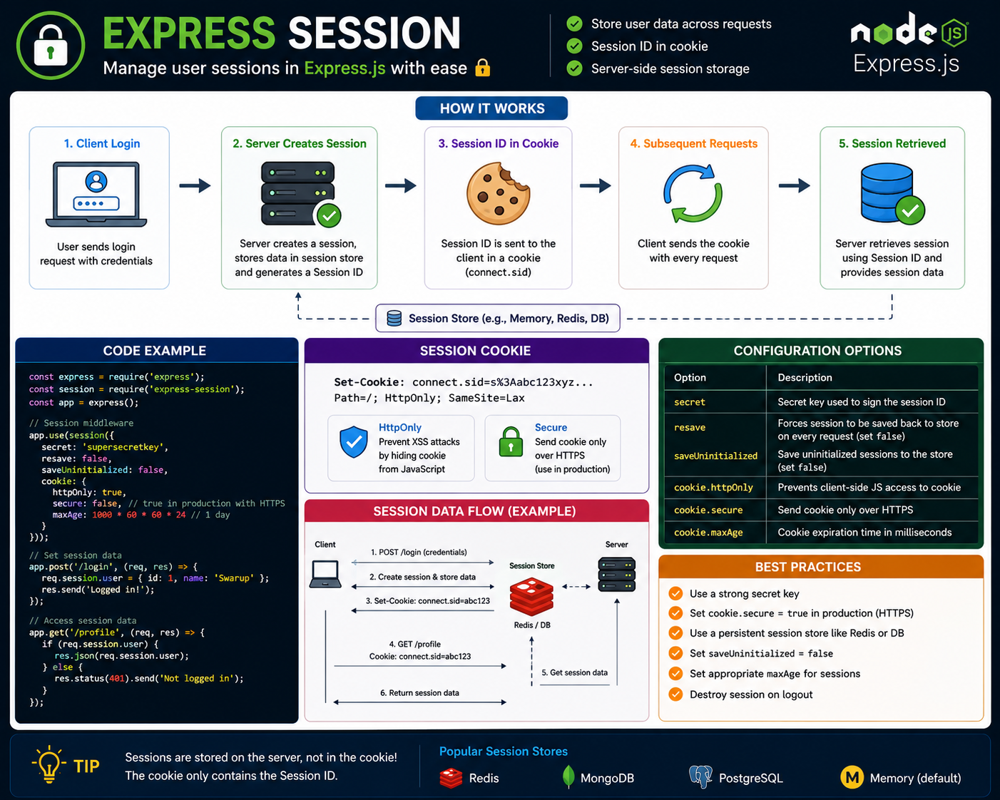

Not every authentication system needs JWTs.

Sometimes, **server-side sessions** are the simplest and most secure choice. 🔐

With `express-session`, the server stores the session data, while the browser only keeps a **Session ID** in a cookie.

Flow:

👤 User logs in
⬇️
🖥️ Server creates a session
⬇️
🍪 Session ID is stored in a cookie
⬇️
🔄 Every request sends the Session ID
⬇️
✅ Server retrieves the user's session

Why developers use sessions:

🔒 Session data stays on the server
🍪 Browser stores only the Session ID
⚡ Easy login/logout management
🛡️ Works great with `HttpOnly` and `Secure` cookies

💡 Never use the default in-memory session store in production. Store sessions in **Redis** or another persistent store for scalability and reliability.

Which do you prefer for authentication: **Sessions** or **JWTs**? 👇

#ExpressJS #NodeJS #Backend #JavaScript #Authentication #Sessions #WebDevelopment #Programming #Coding

