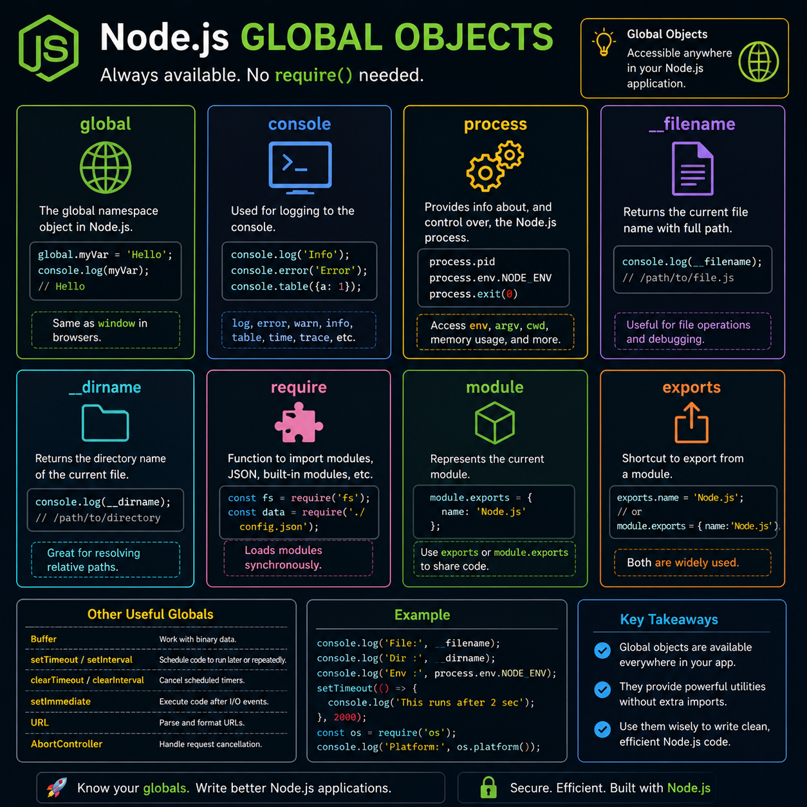

One of the best things about Node.js? Some powerful tools are available **without importing anything.** 🚀

These are called **Global Objects**.

Here's what you'll use most:

🌍 `global` → The global namespace in Node.js
🖥️ `console` → Logging & debugging
⚙️ `process` → Environment variables, arguments, process info
📄 `__dirname` & `__filename` → Current directory and file path
⏰ `setTimeout()` & `setInterval()` → Schedule asynchronous tasks
🛑 `clearTimeout()` & `clearInterval()` → Cancel timers
🌐 `URL`, `AbortController`, `Buffer` → Built-in utilities for modern applications

The more you understand these globals, the less unnecessary code you'll write.

💡 They're always there—learn them once, use them in every Node.js project.

Which Node.js global object do you reach for the most? 👇

#NodeJS #JavaScript #Backend #WebDevelopment #Programming #Coding #100DaysOfCode

